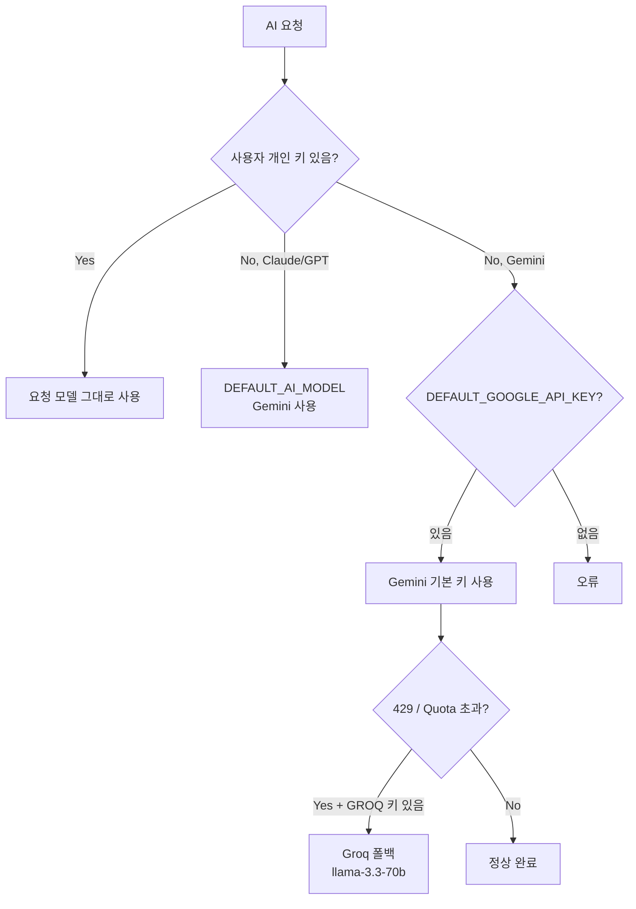

# AI 프로바이더

## 지원 모델

| 모델 ID | 이름 | 입력 $/1M | 출력 $/1M | 웹 검색 |
|---------|------|----------|----------|--------|
| `claude-opus-4-6` | Claude Opus 4.6 | $15 | $75 | ✅ 내장 |
| `claude-sonnet-4-6` | Claude Sonnet 4.6 | $3 | $15 | ✅ 내장 |
| `claude-haiku-4-5` | Claude Haiku 4.5 | $0.8 | $4 | ✅ 내장 |
| `gpt-4o` | GPT-4o | $2.5 | $10 | — |
| `gpt-4o-mini` | GPT-4o mini | $0.15 | $0.6 | — |
| `o3-mini` | o3-mini | $1.1 | $4.4 | — |
| `gemini-2.0-flash` | Gemini 2.0 Flash | $0.075 | $0.3 | ✅ 내장 |
| `gemini-2.5-pro` | Gemini 2.5 Pro | $1.25 | $10 | ✅ 내장 |
| `ollama:<이름>` | 로컬 Ollama | 무료 | 무료 | — |
| `llama:<이름>` | 로컬 llama.cpp | 무료 | 무료 | — |

---

## 폴백 체인



### `resolveEffectiveModel()` 로직

```typescript
// 1. 로컬 모델은 그대로
if (model.startsWith('ollama:') || model.startsWith('llama:')) return model;

// 2. 사용자의 해당 프로바이더 키 확인
const hasKey =
  (provider === ANTHROPIC && user.anthropicApiKey) ||
  (provider === OPENAI    && user.openaiApiKey) ||
  (provider === GOOGLE    && (user.googleApiKey || DEFAULT_GOOGLE_API_KEY()));

// 3. 키 없으면 기본 Gemini로 대체
return hasKey ? model : DEFAULT_AI_MODEL();
```

---

## Default Google 키 — RPM 제한

Free tier 한도(분당 15회) 초과 방지를 위해 기본 키 사용 시 throttle이 적용됩니다.

- 제한: **12 req/min** (5초 간격)
- 개인 Google 키 사용 시는 throttle 없음
- 429 오류 발생 시 → Groq 자동 폴백

---

## Groq 폴백

Gemini 기본 키가 쿼터를 초과하면 자동으로 Groq로 전환합니다.

```env
DEFAULT_GROQ_API_KEY=gsk_...
DEFAULT_GROQ_MODEL=llama-3.3-70b-versatile
```

- Groq는 OpenAI 호환 API (`https://api.groq.com/openai/v1`)
- `callGroq()` / `streamGroq()` 함수로 `callOpenAI()` 재사용
- 폴백 조건: `isUsingDefaultGoogleKey() && isGoogleQuotaError(err) && GROQ_KEY`

---

## AI 호출 로깅

모든 `call()` / `stream()` 호출은 `ai_call_log` 테이블에 기록됩니다.

| 기록 항목 | 설명 |
|----------|------|
| 모델, 사용자 | 추적용 |
| 시스템·유저 프롬프트 | 최대 2000자 |
| 응답 | 최대 2000자 |
| 입출력 토큰, 비용, 소요시간 | 비용 분석용 |
| 오류 메시지 | 디버깅용 |

오류 발생 시 콘솔 로그:
```
[AiProviderService] model=gemini-2.0-flash | ERROR ApiError: {...}
[AiProviderService] model=claude-sonnet-4-6 | STREAM ERROR ...
```

→ `/settings/pipeline` → "AI 호출 이력" 탭에서 확인 (admin 전용)

---

## 프로바이더별 특징

### Anthropic (Claude)

- `web_search_20250305` 툴로 내장 웹 검색 지원
- `tool_use` / `end_turn` stop reason으로 에이전트 루프 제어
- 사용자 개인 키 필수 (시스템 기본 키 없음)

### OpenAI (GPT)

- Function calling으로 툴 사용
- 사용자 개인 키 필수 (시스템 기본 키 없음)

### Google (Gemini)

- `googleSearch` 내장 툴 지원
- VLM (Vision) 지원
- 기본 키(free tier) 사용 시 RPM throttle + Groq 폴백 적용

### Ollama (로컬)

- `ollama:<모델명>` 형식으로 지정
- 툴 사용 지원 (모델에 따라 다름)
- `OllamaInsufficientMemoryError` 발생 시 별도 로깅

### llama.cpp (로컬)

- `llama:<모델명>` 형식으로 지정
- `LLAMA_CPP_BASE_URL` 환경변수로 서버 주소 설정 (기본: `http://localhost:8080`)
- OpenAI 호환 API 사용
