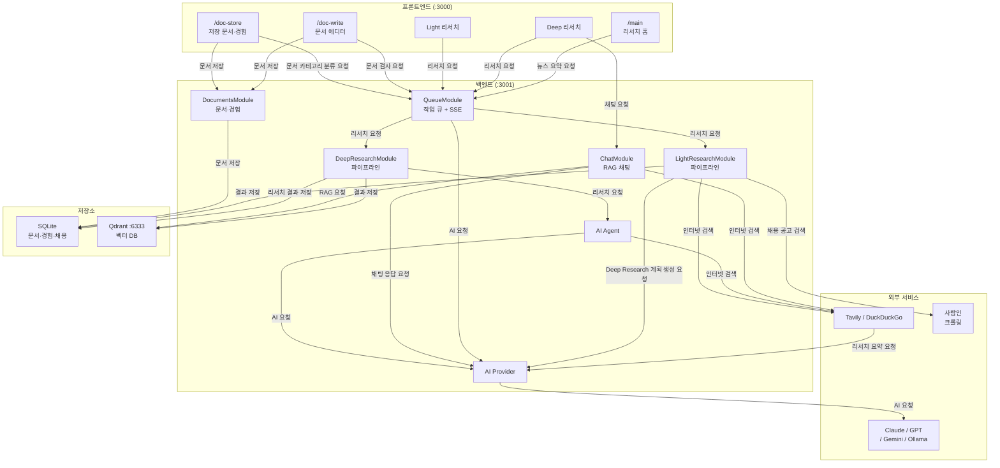
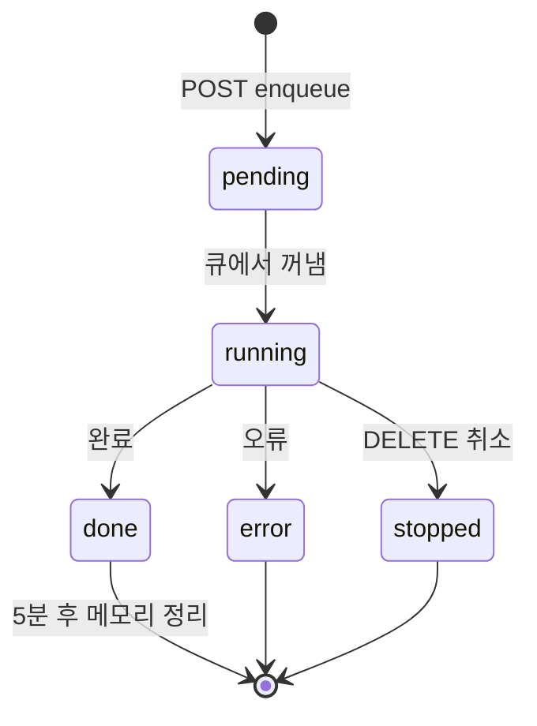
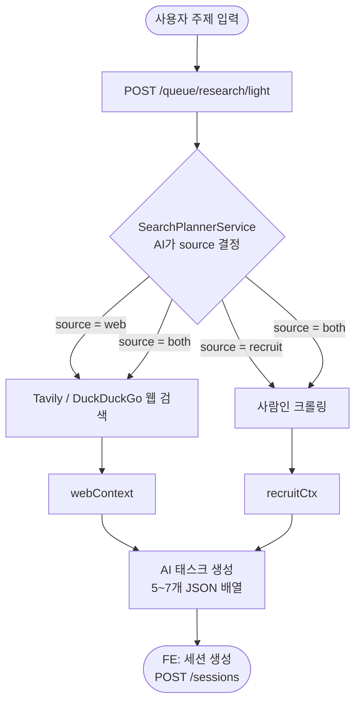
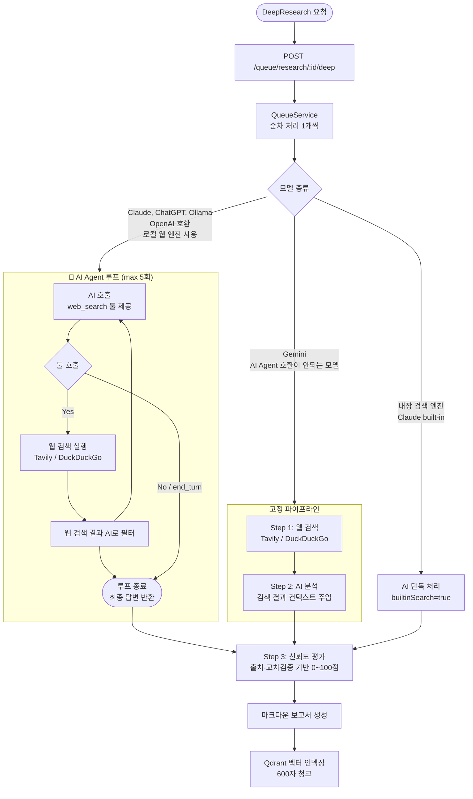
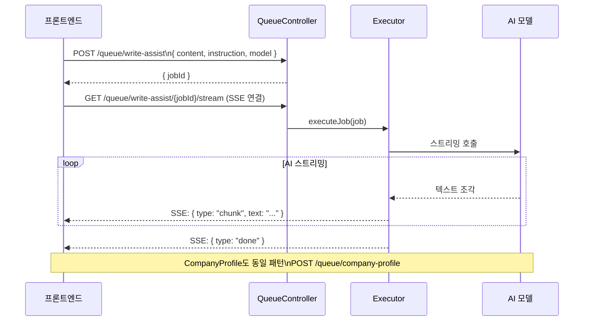
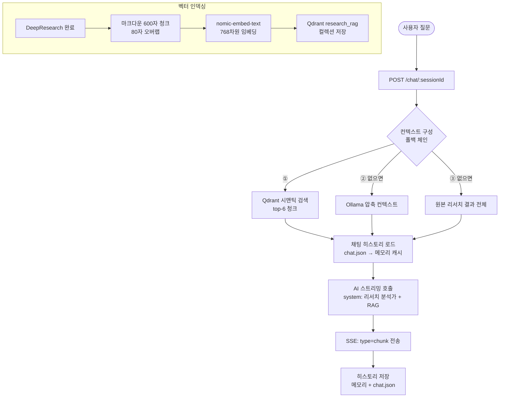
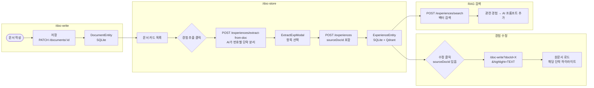

> ⚠️ 이 파일은 더 이상 유지되지 않습니다. [architecture/](architecture/) 폴더를 참고하세요.

# 시스템 아키텍처

---

## 전체 시스템 구조



---

## 전체 디렉터리 구조

```
ResearchAI/
├── run.sh                  # 1-click 실행 스크립트 (Qdrant + BE + FE)
├── docs/                   # 이 문서들
├── data/
│   ├── sessions/           # 리서치 세션 데이터 (JSON 파일)
│   │   └── {sessionId}/
│   │       ├── session.json   ← 태스크·결과·소스·상태
│   │       └── chat.json      ← 채팅 히스토리
│   └── qdrant/             # Qdrant 벡터 DB 볼륨
│
├── BE/                     # NestJS 백엔드 (:3001)
│   └── src/
│       ├── ai/             # AI 모델 관리 (Ollama, Google AI, Claude)
│       ├── backgrounds/    # 백그라운드 작업 관리
│       ├── chat/           # RAG 채팅
│       ├── config/         # 앱 설정
│       ├── database/       # SQLite 연결 (TypeORM + better-sqlite3)
│       ├── documents/      # 문서·경험 관리
│       ├── gmail/          # Gmail OAuth 연동
│       ├── media/          # 미디어 파일
│       ├── news/           # 뉴스 조회·요약
│       ├── overview/       # 대시보드·상태
│       ├── queue/          # 작업 큐 + SSE 스트리밍
│       ├── recruit/        # 채용 공고 크롤링
│       ├── research/       # Light/Deep Research 파이프라인
│       ├── sessions/       # 리서치 세션 (파일 I/O)
│       ├── shared/         # 공통 예외·필터
│       └── vector/         # Qdrant 벡터 인덱싱·검색
│
└── FE/                     # Next.js 14 프론트엔드 (:3000)
    └── app/
        ├── main/           # /main — 리서치 홈
        ├── sessions/       # /sessions/[id] — 리서치 결과
        ├── doc-write/      # /doc-write — 문서 에디터
        ├── doc-store/      # /doc-store — 저장 문서·경험
        ├── doc-parse/      # /doc-parse — 문서 파싱·Q&A
        ├── settings/       # /settings — 설정
        ├── components/     # 전역 공통 컴포넌트
        ├── contexts/       # React Context (큐 상태 등)
        └── lib/api/        # 백엔드 API 호출 함수
```

---

## 백엔드 레이어 구조 (DDD)

모든 모듈은 동일한 4계층 구조를 따릅니다.

```
{module}/
├── presentation/    — HTTP 컨트롤러 (라우팅, DTO 검증)
├── application/     — 서비스 (비즈니스 로직)
├── domain/          — 순수 타입·인터페이스·엔티티
└── infrastructure/  — 외부 연동 (DB·크롤러·AI·검색)
```

---

## 데이터베이스

- **세션 데이터**: 파일 기반 JSON (`data/sessions/`)
- **문서·경험·채용 공고**: SQLite (TypeORM + better-sqlite3, `BE/data/db.sqlite`)
- **벡터 데이터**: Qdrant Docker 컨테이너 (`:6333`)

### SQLite 엔티티

#### DocumentEntity
| 필드 | 타입 | 설명 |
|------|------|------|
| `id` | string (PK) | UUID |
| `title` | string | 문서 제목 |
| `content` | text | 문서 내용 (마크다운) |
| `companyName` | text \| null | 지원 기업명 |
| `experiences` | ExperienceEntity[] | 연결된 경험 목록 (One-to-Many) |
| `createdAt` | Date | |
| `updatedAt` | Date | |

#### ExperienceEntity
| 필드 | 타입 | 설명 |
|------|------|------|
| `id` | string (PK) | UUID |
| `title` | string | 경험 제목 |
| `content` | text | 경험 내용 |
| `category` | string \| null | 카테고리 (수동) |
| `aiCategories` | string[] \| null | AI 추천 카테고리 (JSON) |
| `sourceDocId` | text \| null | 추출 원본 문서 ID |
| `document` | DocumentEntity \| null | Many-to-One |
| `createdAt` | Date | |
| `updatedAt` | Date | |

**중요**: `string | null` 필드는 반드시 `@Column({ type: 'text', nullable: true })` 명시 필요 (TypeORM 버그 회피).

---

## 큐 시스템

모든 비동기 AI 작업은 큐를 통해 처리됩니다. **enqueue → SSE stream** 패턴을 사용합니다.



```
클라이언트
  1. POST /queue/{작업종류}   →  { jobId }
  2. GET  /queue/{작업종류}/{jobId}/stream  (SSE 연결)
  3. DELETE /queue/{작업종류}/{jobId}  (취소)
```

### TaskType 목록

| TaskType | 설명 | Executor |
|----------|------|----------|
| `DEEPRESEARCH` | 세션 태스크 심층 분석 | DeepResearchExecutorService |
| `LIGHTRESEARCH` | 주제 → 태스크 목록 생성 | LightResearchExecutorService |
| `SUMMARY` | 세션 결과 요약 | SummaryExecutorService |
| `WRITEASSIST` | 문서 작성 AI 어시스턴트 | WriteAssistExecutorService |
| `COMPANYPROFILE` | 기업 인재상 웹 검색·합성 | CompanyProfileExecutorService |

### SSE 이벤트 타입

```typescript
enum SseEventType {
  LOG   = 'log',    // 진행 로그 메시지
  CHUNK = 'chunk',  // AI 스트리밍 텍스트 조각
  DONE  = 'done',   // 완료
  ERROR = 'error',  // 오류
}
```

### QueueJob 인터페이스

```typescript
interface QueueJob {
  jobId: string;
  sessionId: string;
  itemId: string;
  itemPrompt: string;
  taskType: QueueJob.TaskType;
  localAIModel: string;
  CloudAIModel: string;
  status: 'pending' | 'running' | 'done' | 'error' | 'stopped';
  phase?: 'searching' | 'analyzing';
  webSources?: SearchSources;
  result?: string;
}
```

---

## 핵심 파이프라인 1 — LightResearch

주제 → 리서치 태스크 목록 생성.

```
POST /queue/research/light  →  { searchId }
GET  /queue/research/light/{searchId}/stream  (SSE)

SSE 이벤트:
  { type: 'log',  message: string }
  { type: 'plan', source: 'web'|'recruit'|'both', keyword, companyTypes, jobTypes }
  { type: 'done', tasks: Task[], searchPlan }

Task 구조:
  { id: number, title: string, icon: string, prompt: string }
```



---

## 핵심 파이프라인 2 — DeepResearch

태스크별 심층 분석. 큐에서 순차 처리.

```
POST /queue/research/{sessionId}/deep  →  { status, sessionId }
DELETE /queue/research/{sessionId}/deep  (전체 취소)
DELETE /queue/research/{sessionId}/deep/items/{itemId}  (개별 취소)

GET /queue/events  (전역 큐 SSE)
  → { type: 'sync', jobs: QueueJob[] }
```



---

## 핵심 파이프라인 3 — WriteAssist & CompanyProfile

enqueue → SSE stream 공통 패턴.



**WriteAssist instruction 구성 (FE에서 조립):**
```
{companyCtx}        ← skipCompanyCtx=true면 생략
## 작성 중인 글
{content}
## 요청사항
{action prompt}
```

**CompanyProfile 내부 처리:**
```
WebSearchService.runSearch("{companyName} 인재상 핵심가치 채용 공식")
  → 결과 있음: AI로 합성 → 스트리밍
  → 결과 없음: AI 학습 기반 응답 (경고 포함) → 스트리밍
```

---

## RAG 채팅

리서치 결과를 벡터 검색해 AI 답변 생성.

```
POST /chat/{sessionId}
  Body: { message: string, model: string }
  SSE Response:
    { type: 'chunk', text: string }
    { type: 'done' }
```



---

## 문서·경험 관리 흐름



---

## 채용 공고 모듈

사람인 크롤링 + 필터링.

**사람인 URL 파라미터 매핑:**

| 필터 | 값 | 파라미터 |
|------|----|---------|
| 대기업 | `emp_tp=1` | |
| 중견기업 | `emp_tp=2` | |
| 중소기업 | `emp_tp=3` | |
| 외국계 | `emp_tp=4` | |
| 공기업 | `emp_tp=5` | |
| 스타트업 | `emp_tp=6` | |
| 신입 | `career_cd=1` | |
| 경력 | `career_cd=2` | |
| 인턴 | `job_type=3` | |

---

## 파일 기반 세션 저장소

```json
// data/sessions/{sessionId}/session.json
{
  "id": "uuid",
  "topic": "주제",
  "model": "claude-sonnet-4-6",
  "createdAt": "ISO8601",
  "tasks": [{ "id": 1, "title": "...", "icon": "🔍", "prompt": "..." }],
  "results":  { "1": "마크다운 결과..." },
  "statuses": { "1": "done" },
  "sources": {
    "1": { "tavily": "...", "serper": "...", "ollama": "..." }
  }
}

// data/sessions/{sessionId}/chat.json
[
  { "role": "user",      "content": "질문" },
  { "role": "assistant", "content": "답변" }
]
```

---

## 외부 서비스 의존성

| 서비스 | 용도 | 필수 여부 |
|--------|------|----------|
| Anthropic API | Claude 모델 | AI 1개 이상 필수 |
| OpenAI API | GPT 모델 | 선택 |
| Google GenAI | Gemini 모델 | 선택 |
| Ollama | 로컬 AI (검색계획·필터링·임베딩·압축) | 선택 (권장) |
| Qdrant | 벡터 DB (RAG) | 선택 (없으면 fallback) |
| Tavily | 웹 검색 | 선택 (1개 이상 권장) |
| Serper | Google 검색 | 선택 |
| Naver | 한국어 검색 | 선택 |
| Brave | 독립 검색 | 선택 |
| 사람인 | 채용 공고 크롤링 | 선택 |
| Gmail OAuth | 메일 연동 | 선택 |
