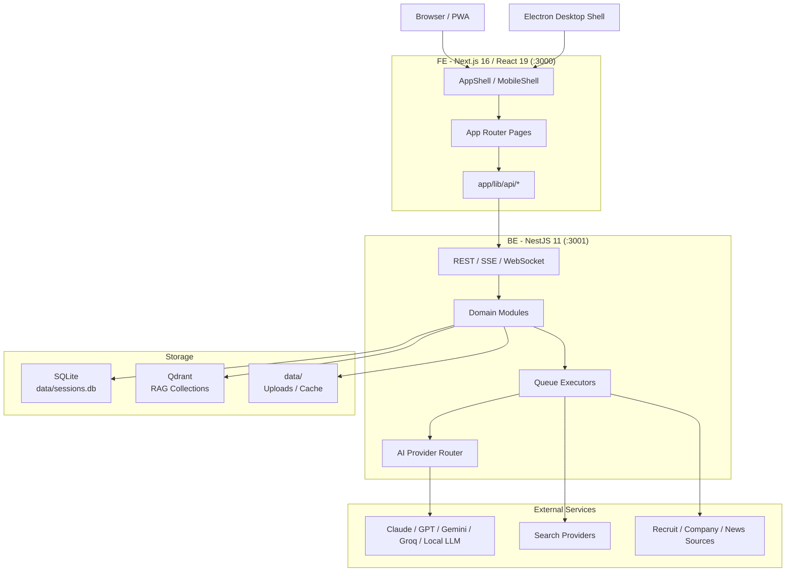
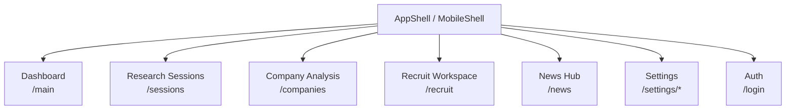
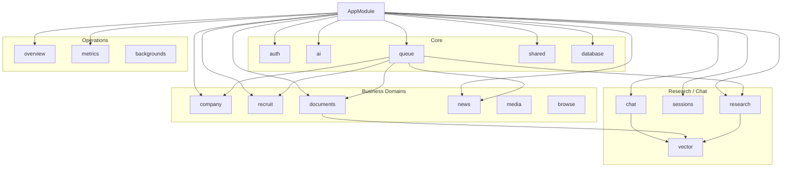
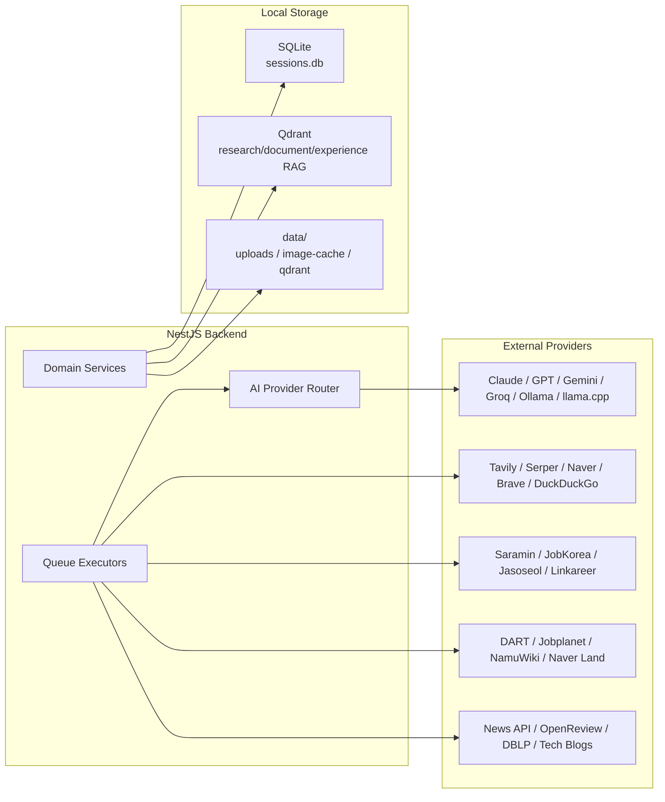
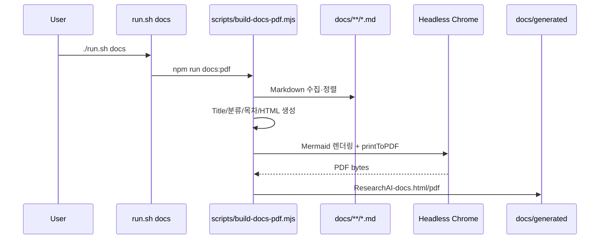

# 시스템 아키텍처 개요

ResearchAI는 Next.js 프론트엔드, NestJS 백엔드, SQLite 기반 영속 저장소, Qdrant 벡터 저장소, 멀티 AI Provider, 비동기 Queue/SSE 실행 모델로 구성된 리서치·채용·기업 분석 통합 도구입니다.

---

## 전체 구조도



이 구조도는 전체 레이어만 보여줍니다. 세부 라우트, 백엔드 모듈, 외부 연동은 아래 다이어그램으로 분리해 PDF에서 읽을 수 있는 크기를 유지합니다.

### 프론트엔드 라우트 구조



상세 페이지 경로는 아래 `프론트엔드 라우트 맵` 표에서 관리합니다. 다이어그램은 PDF 인쇄 시 한 페이지에 들어가도록 대표 라우트만 표시합니다.

### 백엔드 모듈 구조



### 데이터와 외부 연동



---

## 런타임 구성

| 영역 | 기술 | 역할 |
|------|------|------|
| 프론트엔드 | Next.js 16, React 19, Tailwind CSS v4 | App Router 기반 웹 UI, PWA, 모바일/데스크탑 Shell |
| 백엔드 | NestJS 11, TypeORM, better-sqlite3 | REST/SSE/WebSocket API, 도메인 서비스, 크롤러·AI 오케스트레이션 |
| 데스크탑 | Electron 41 | macOS 데스크탑 패키징 Shell |
| 큐 | 자체 QueueService | 장시간 AI/크롤링 작업 실행, 상태 DB 기록, SSE 스트리밍 |
| 벡터 DB | Qdrant | 리서치·문서·경험 RAG 검색 |
| 문서 생성 | `scripts/build-docs-pdf.mjs` | `docs/` Markdown 통합 HTML/PDF 생성, Mermaid 렌더링 |
| 배포 | `run.sh deploy`, k3s, ArgoCD, Grafana/Prometheus | GitOps 배포와 모니터링 구성 |

---

## 요청 흐름

### 일반 API

1. FE의 `app/lib/api/*` 래퍼가 `API_BASE`로 REST 요청을 보냅니다.
2. `AuthContext`가 JWT를 관리하고, `auth-context.middleware`가 요청 컨텍스트에 사용자·API 키를 주입합니다.
3. NestJS 컨트롤러는 `presentation → application → domain/infrastructure` 흐름으로 처리합니다.
4. TypeORM 엔티티는 SQLite(`data/sessions.db`)에 저장됩니다.

### 장시간 작업

1. FE가 `/queue/*` 또는 각 도메인 enqueue API를 호출합니다.
2. `QueueService`가 `QueueJobEntity`를 만들고 executor를 실행합니다.
3. executor는 AI Provider, 검색 Provider, 크롤러, 문서 파서 등을 호출합니다.
4. 결과와 로그는 SSE로 FE에 스트리밍되고, 완료 결과는 SQLite에 저장됩니다.

### RAG / 문서 검색

1. 문서·경험·리서치 결과가 청크 단위로 Qdrant에 색인됩니다.
2. Chat, 문서 검색, 경험 검색은 Qdrant semantic search를 먼저 수행합니다.
3. AI 응답은 검색 결과와 대화 히스토리 또는 첨부 문서를 함께 사용합니다.

---

## 디렉터리 구조

```
ResearchAI/
├── run.sh                       # dev/prod/docs/deploy 진입점
├── package.json                 # Electron + docs PDF 스크립트
├── scripts/
│   └── build-docs-pdf.mjs       # docs 통합 HTML/PDF 생성
├── docs/
│   ├── README.md
│   ├── architecture/
│   ├── feature/
│   ├── pipelines/
│   ├── reference/
│   ├── desktop/
│   ├── legacy/
│   ├── generated/               # ResearchAI-docs.html/pdf
│   └── erd.vuerd.json
├── data/
│   ├── sessions.db              # SQLite DB
│   ├── qdrant/                  # Qdrant 볼륨
│   └── recruit/image-cache/     # OCR/VLM 이미지 캐시
├── BE/
│   └── src/
│       ├── app.module.ts
│       ├── database/            # TypeORM + 마이그레이션성 rename 보정
│       ├── auth/                # JWT, 사용자, 개인 API 키
│       ├── ai/                  # Claude/GPT/Gemini/Groq/Ollama/llama.cpp
│       ├── queue/               # 장시간 작업 큐와 executor
│       ├── research/            # Light/Deep Research, 검색 Provider
│       ├── sessions/            # 리서치 세션·태스크·WebSocket
│       ├── chat/                # RAG 채팅
│       ├── vector/              # Qdrant 래퍼
│       ├── company/             # 기업 분석, DART/Jobplanet/Saramin 등
│       ├── recruit/             # 채용 공고, 자소서, 이력서, 문서, 시험 일정
│       ├── news/                # 뉴스, 논문, 테크블로그, AI 리더보드
│       ├── media/               # PDF/DOCX/이미지 텍스트 추출
│       ├── browse/              # Puppeteer 기반 브라우징
│       ├── overview/            # API 키·사용량·토큰 통계
│       ├── metrics/             # Prometheus metrics
│       ├── backgrounds/         # 배경 이미지
│       └── shared/              # 공통 컨텍스트·예외·응답·회로차단기
└── FE/
    └── app/
        ├── layout.tsx           # AuthProvider + AppShell
        ├── components/          # Shell, Sidebar, QueueWidget, TopicInput
        ├── contexts/            # Auth/Theme/Sidebar/Modal contexts
        ├── lib/api/             # REST/SSE API 래퍼
        ├── main/                # 대시보드
        ├── sessions/            # 리서치 세션
        ├── companies/           # 기업 목록·상세
        ├── company-analysis/    # 기업 분석 워크스페이스
        ├── recruit/             # 채용 허브·작성·공고·이력서·문서·스펙
        ├── news/                # 뉴스·논문·테크블로그·리더보드
        ├── settings/            # 설정·분석·파이프라인·시스템
        └── login/               # 로그인·회원가입
```

---

## 백엔드 모듈 맵

| 모듈 | 주요 책임 |
|------|-----------|
| `auth` | 사용자, JWT, 로그인 이력, 개인 API 키, 기본 모델 |
| `ai` | AI Provider 라우팅, 스트리밍, 호출 로그, 신뢰도 평가 |
| `queue` | Light/Deep Research, Write Assist, OCR, 기업 분석, 스펙 분석, 뉴스/논문 요약 executor |
| `research` | 검색 계획, 멀티 검색 Provider, Light/Deep Research 파이프라인 |
| `sessions` | 리서치 세션·태스크 CRUD, WebSocket 상태 브로드캐스트 |
| `chat` | 세션 RAG 채팅, 히스토리 압축 |
| `vector` | Qdrant 컬렉션 생성, 청크 색인, semantic search |
| `company` | 기업 DB, 기업 분석, 결측 보강 큐, DART/Jobplanet/Saramin/NamuWiki/Naver Land |
| `recruit` | 채용 공고 수집·추천, 합격 자소서, 이력서/자소서, 기업 뉴스, 시험 일정 |
| `documents` | 채용 문서 저장, PDF/DOCX 파싱, 경험 추출, RAG 색인 |
| `news` | 뉴스 기사, 핫 논문, 트렌드 요약, 테크블로그, AI 리더보드 |
| `media` | 업로드 파일 텍스트 추출, 이미지 OCR/VLM |
| `browse` | Puppeteer 유틸, 브라우저 자동화, 검색 사이트 fallback |
| `overview` | 시스템 API 키, 사용량·비용·토큰 통계 |
| `metrics` | Prometheus `/metrics` |
| `backgrounds` | 사용자 배경 이미지 |
| `shared` | requestContext, 응답 인터셉터, 예외 필터, 회로 차단기 |

---

## 프론트엔드 라우트 맵

| 경로 | 설명 |
|------|------|
| `/main` | 대시보드: 뉴스, 날씨, 캘린더, 마켓, 지도, 검색 |
| `/sessions`, `/sessions/[id]`, `/sessions/new` | 리서치 세션 목록·상세·생성 |
| `/companies`, `/companies/[id]`, `/companies/analysis` | 기업 목록, 상세, AI 기업 분석 |
| `/company-analysis` | 기업 분석 전용 워크스페이스와 채팅 패널 |
| `/recruit` | 채용 허브: 공고 추천, 자소서, 문서 업로드 |
| `/recruit/write` | 자기소개서 작성 에디터와 AI 작성 도우미 |
| `/recruit/job-posting` | 채용 공고 수집, 필터, 상세, 추천 |
| `/recruit/resume` | 이력서·자소서 타겟 관리, AI 평가, 합격 자소서 검색 |
| `/recruit/cover-letter` | 합격 자소서 브라우저 |
| `/recruit/spec` | 합격 자소서 기반 스펙 분석 |
| `/recruit/doc-store` | 문서·경험 라이브러리 |
| `/recruit/doc-parse` | 문서 파싱·포트폴리오 평가 |
| `/news` | 뉴스 허브 |
| `/news/feed` | 뉴스 피드 |
| `/news/papers` | 핫 논문 |
| `/news/tech-blogs` | 테크블로그 |
| `/news/leaderboard` | AI 모델 리더보드 |
| `/settings/*` | 개요, 분석, 호출 로그, 파이프라인 테스트, 시스템, 배경 |
| `/login` | 로그인·회원가입 |

---

## 데이터 저장소

| 저장소 | 위치 | 내용 |
|--------|------|------|
| SQLite | `data/sessions.db` | 사용자, 세션, 태스크, 큐, AI 로그, 기업, 채용, 뉴스, 문서 메타데이터 |
| Qdrant | `data/qdrant/` | `research_rag`, `experience_rag`, `document_rag` 등 벡터 컬렉션 |
| 파일 캐시 | `data/` | 업로드/이미지/OCR 캐시, 브라우저·크롤링 중간 산출물 |
| 문서 산출물 | `docs/generated/` | 통합 HTML/PDF |

`DatabaseModule`은 `better-sqlite3`와 TypeORM `synchronize: true`를 사용하며, 일부 과거 테이블명은 `prepareDatabase`에서 현재 테이블명으로 rename 보정합니다.

---

## 외부 서비스 의존성

| 서비스 | 용도 | 필수 여부 |
|--------|------|----------|
| Google Gemini | 기본 AI, OCR/VLM, 일부 무료/기본 호출 | 권장 |
| Groq | Gemini 쿼터 초과 시 폴백 | 권장 |
| Anthropic Claude | 고성능 문서·리서치·작성 AI | 선택 |
| OpenAI GPT | 작성·분석 AI | 선택 |
| Ollama / llama.cpp | 로컬 AI, 임베딩, 로컬 추론 | 선택/권장 |
| Qdrant | RAG 벡터 검색 | 권장 |
| Tavily / Serper / Naver / Brave | 웹 검색 Provider | 선택 |
| DuckDuckGo | 무료 검색 fallback | 내장 |
| DART / Jobplanet / Saramin / NamuWiki / Naver Land | 기업 분석·보강 | 선택 |
| 채용 사이트 | 채용 공고·합격 자소서 수집 | 선택 |
| Gmail OAuth | 대시보드 메일 연동 | 선택 |

AI 키 우선순위는 사용자 개인 키 → 시스템 기본 키 → 가능한 fallback Provider 순서입니다. Anthropic/OpenAI 개인 키는 `auth` 모듈의 사용자 설정으로 관리하고, 시스템 기본 키와 사용량 통계는 `overview/config` 계열에서 다룹니다.

---

## 문서 생성 자동화

`./run.sh docs`는 루트 `npm run docs:pdf`를 호출합니다.



표지에는 문서 수, 총 페이지 수, 한국 시간 기준 생성일시(`YYYY-MM-DD HH:mm:ss KST`)가 표시됩니다.
