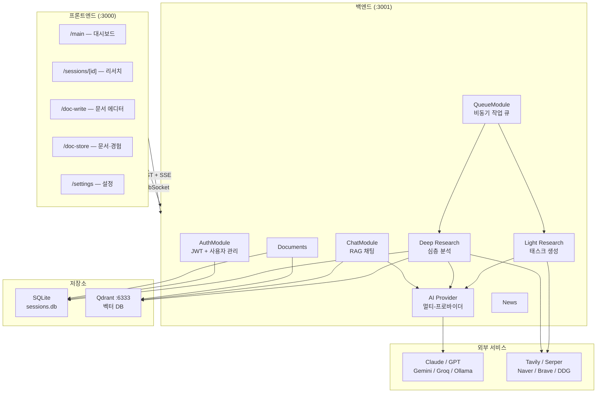

# 시스템 아키텍처 개요

## 전체 구조도



---

## 디렉터리 구조

```
ResearchAI/
├── run.sh                  # 1-click 실행 (Qdrant + BE + FE)
├── docs/                   # 이 문서들
│   ├── README.md
│   ├── architecture/
│   ├── pipelines/
│   ├── auth.md
│   ├── ai-providers.md
│   └── api-reference.md
├── data/
│   ├── sessions.db         # SQLite (TypeORM, 전체 데이터)
│   └── qdrant/             # Qdrant 벡터 DB 볼륨
│
├── BE/                     # NestJS 백엔드 (:3001)
│   ├── .env
│   └── src/
│       ├── ai/             # AI 프로바이더 (멀티-폴백)
│       ├── auth/           # JWT 인증, 사용자 관리
│       ├── backgrounds/    # 배경 이미지
│       ├── chat/           # RAG 채팅
│       ├── config/         # 앱 설정 KV 스토어
│       ├── database/       # TypeORM 설정
│       ├── documents/      # 문서·경험 관리
│       ├── gmail/          # Gmail OAuth
│       ├── media/          # 파일 업로드 (PDF 파싱)
│       ├── news/           # 뉴스 수집·요약
│       ├── overview/       # 대시보드·통계·API 키 관리
│       ├── queue/          # 비동기 작업 큐 + SSE
│       ├── recruit/        # 채용 공고 (사람인)
│       ├── research/       # Light/Deep Research 파이프라인
│       ├── sessions/       # 세션·태스크 CRUD (TypeORM)
│       ├── shared/         # 공통 미들웨어·예외·컨텍스트
│       └── vector/         # Qdrant 임베딩·검색
│
└── FE/                     # Next.js 14 프론트엔드 (:3000)
    └── app/
        ├── main/           # 대시보드 (뉴스·날씨·캘린더·지도)
        ├── sessions/       # 리서치 세션 목록·상세
        ├── doc-write/      # 문서 에디터
        ├── doc-store/      # 저장 문서·경험
        ├── settings/       # 설정 (overview·analytics·pipeline·system)
        ├── landing/        # 랜딩 페이지
        ├── login/          # 로그인·회원가입
        ├── components/     # 전역 공통 컴포넌트
        ├── contexts/       # React Context
        └── lib/api/        # 백엔드 API fetch 래퍼
```

---

## 외부 서비스 의존성

| 서비스 | 용도 | 필수 여부 |
|--------|------|----------|
| Google Gemini (free) | 기본 AI (미설정 사용자) | 권장 — `DEFAULT_GOOGLE_API_KEY` |
| Groq | Gemini 쿼터 초과 시 자동 폴백 | 권장 — `DEFAULT_GROQ_API_KEY` |
| Anthropic Claude | 고성능 AI (사용자 개인 키) | 선택 |
| OpenAI GPT | AI (사용자 개인 키) | 선택 |
| Ollama | 로컬 AI (임베딩·필터링) | 권장 |
| Qdrant | 벡터 DB (RAG) | 권장 |
| Tavily | 웹 검색 | 선택 (권장) |
| Serper / Naver / Brave | 보조 검색 | 선택 |
| DuckDuckGo | 무료 웹 검색 (항상 사용 가능) | 내장 |
| Gmail OAuth | 메일 연동 | 선택 |

> **AI 사용 정책**: Anthropic·OpenAI는 사용자 개인 API 키만 사용합니다. 개인 키가 없으면 시스템 기본 키(Gemini → Groq)로 자동 대체됩니다.
