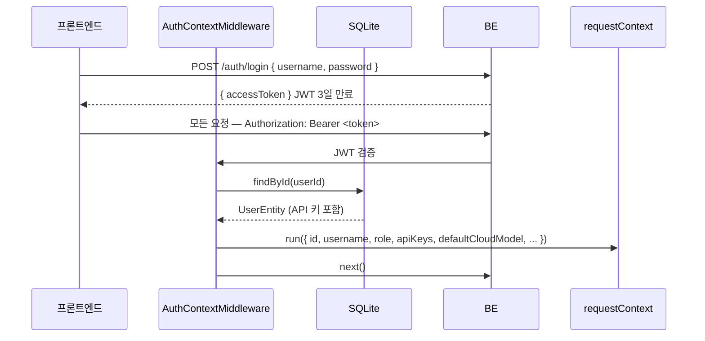

# 인증 및 사용자 API 키

## 인증 흐름



- JWT 만료 3일, 잔여 1일 미만이면 응답 헤더에 새 토큰 반환 (`X-New-Token`)
- 비로그인 요청: `X-Anon-Id` 헤더를 익명 ID로 사용 (게스트 모드)

---

## 역할 (Role)

| 역할 | 기본값 | 권한 |
|------|--------|------|
| `visitor` | 회원가입 시 기본 | 일반 기능 전체 |
| `admin` | 관리자 설정 필요 | visitor + 파이프라인 테스트 페이지 접근 |

- FE: `/settings/pipeline` 접근 → admin이 아니면 403 리다이렉트
- 사이드바 메뉴에서 Pipeline 항목 숨김 (non-admin)

---

## 사용자별 API 키

API 키는 `users` 테이블 컬럼으로 사용자마다 분리 저장됩니다.

```
사용자 A: anthropicApiKey = sk-ant-A...
사용자 B: anthropicApiKey = sk-ant-B...
사용자 C: anthropicApiKey = null  → Gemini 기본 키 사용
```

### 지원 키 목록

| 키 이름 | 용도 |
|---------|------|
| `ANTHROPIC_API_KEY` | Claude 모델 |
| `OPENAI_API_KEY` | GPT 모델 |
| `GOOGLE_API_KEY` | Gemini 모델 (개인) |
| `TAVILY_API_KEY` | 웹 검색 |
| `SERPER_API_KEY` | Google 검색 |
| `NAVER_CLIENT_ID/SECRET` | 네이버 검색 |
| `BRAVE_API_KEY` | Brave 검색 |

### 설정 방법

`/settings/overview` → API Keys 테이블에서 각 키 입력.

저장 API: `PATCH /auth/api-keys`

```json
{ "key": "ANTHROPIC_API_KEY", "value": "sk-ant-..." }
```

---

## 기본 모델 설정

사용자별로 기본 클라우드/로컬 모델을 지정할 수 있습니다.

```
PATCH /auth/default-models
Body: { cloudModel?: string, localModel?: string }
```

`/settings/overview` → "클라우드 AI 모델 기본값" / "로컬 모델 기본값" 에서 설정.

---

## 시스템 기본 키 (`.env`)

사용자 개인 키가 없을 때 적용되는 시스템 공용 키입니다.

```env
DEFAULT_AI_MODEL=gemini-2.0-flash        # 기본 AI 모델
DEFAULT_GOOGLE_API_KEY=AIz...            # 기본 Google 키
DEFAULT_GROQ_API_KEY=gsk_...             # Gemini 쿼터 초과 시 폴백
DEFAULT_GROQ_MODEL=llama-3.3-70b-versatile
```

**중요**: Anthropic·OpenAI는 시스템 기본 키를 제공하지 않습니다. 개인 키 없이 Claude·GPT 모델을 선택하면 자동으로 Gemini(또는 Groq)로 대체됩니다.

→ AI 폴백 로직 상세: [ai-providers.md](ai-providers.md)
