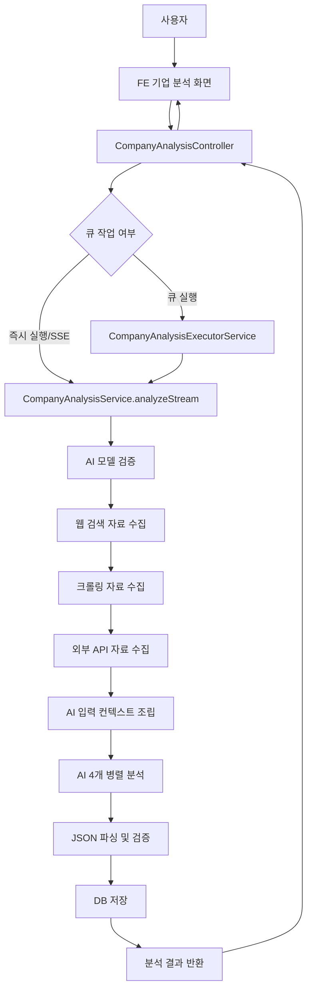
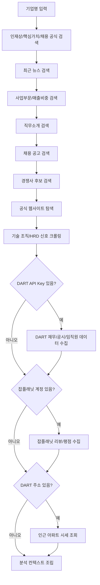
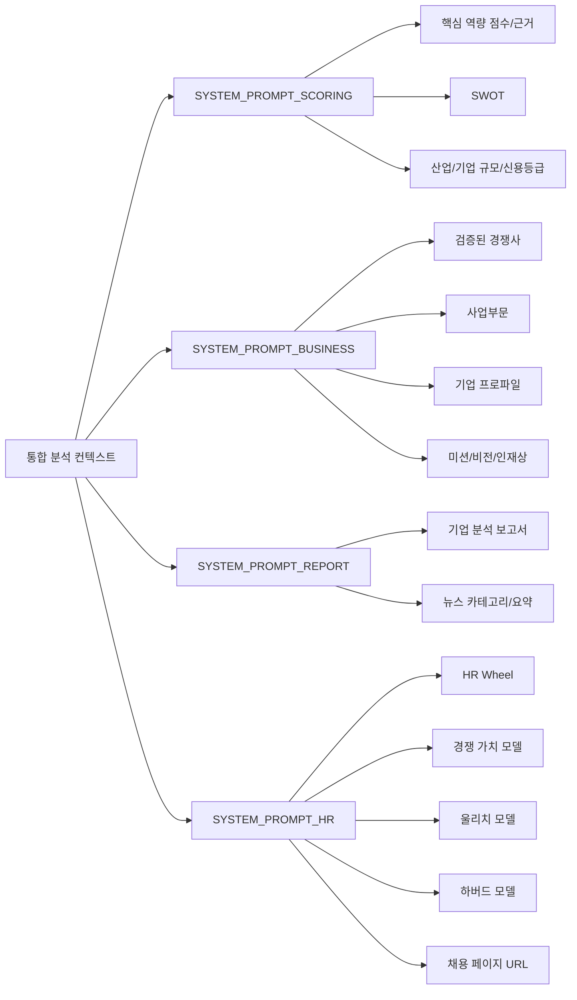
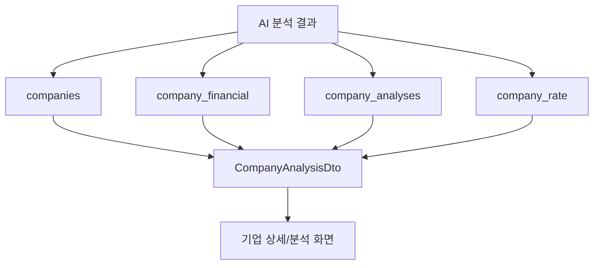

# 기업 분석 구조

## 목적

현재 BE에서 기업 분석이 어떻게 동작하는지 정리한다.
Spring BE와 BE_BROWSE 분리 이후에는 이 흐름을 기준으로 기업 분석 요청, 자료 수집, AI 분석, 결과 저장 구조를 재구성한다.

## 현재 BE 출처

| 영역 | 현재 파일 |
|------|-----------|
| 기업 분석 API | `BE/src/company/presentation/company-analysis.controller.ts` |
| 기업 분석 실행 | `BE/src/company/application/company-analysis.service.ts` |
| 큐 기반 기업 분석 실행 | `BE/src/queue/application/job/company-analysis-executor.service.ts` |
| 기업 분석 프롬프트 | `BE/src/company/domain/company-analysis.prompts.ts` |
| 기업 분석 DTO | `BE/src/company/domain/company-analysis.types.ts` |
| 기업 분석 저장 엔티티 | `BE/src/company/domain/entity/company-analysis.entity.ts` |

## 전체 동작 구조

## 자료 수집 흐름

## AI 분석 병렬 호출

## 결과 저장 흐름

## 저장되는 주요 산출물

| 산출물 | 설명 |
|--------|------|
| `scores` | 13개 핵심 역량 점수 |
| `reasons` | 역량별 점수 근거 |
| `summary` | 인재상/조직문화 요약 |
| `swot` | 강점, 약점, 기회, 위협 |
| `competitors` | 크롤링 출처로 검증된 경쟁사 |
| `businessSegments` | 사업부문, 매출비중, 제품/시설/종속회사 |
| `companyProfile` | 사업영역, 직무소개, 핵심가치, 주요 업적 |
| `missionVision` | 미션, 비전, 핵심가치, 인재상 |
| `recentNews` | 최근 뉴스와 AI 카테고리/요약 |
| `jobPostings` | 채용 공고 링크 |
| `hrTechSources` | 기술 조직/HRD 분석에 사용한 출처 |
| `hrAnalysis` | HR Wheel, CVF, 울리치 모델, 하버드 모델 |
| `report` | 기업 개요, 사업 모델, 재무, 조직문화, 투자 관점 보고서 |
| `sourceContext` | AI에 제공한 통합 원자료 묶음 |

## BE_BROWSE 이전 시 고려사항

- BE는 기업 분석 요청과 결과 조회 DTO만 담당한다.
- BE_BROWSE는 검색, 크롤링, DART/잡플래닛 연동, AI 분석, 결과 파싱을 담당한다.
- 분석 요청은 UUID 기반 큐 작업으로 등록하고, 상태는 `queued`, `running`, `done`, `failed`로 관리한다.
- AI 병렬 호출은 `scoring`, `business`, `report`, `hr` 작업 단위로 분리한다.
- JSON 응답은 작업별 파서에서 검증하고, 실패한 하위 분석은 부분 실패로 기록한다.
- `sourceContext`는 이후 기업 분석 챗봇/근거 확인에 사용되므로 반드시 저장한다.
