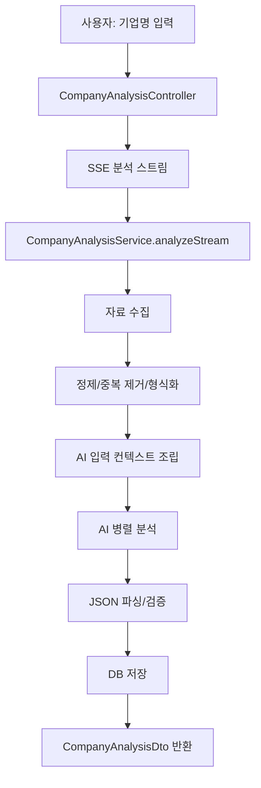
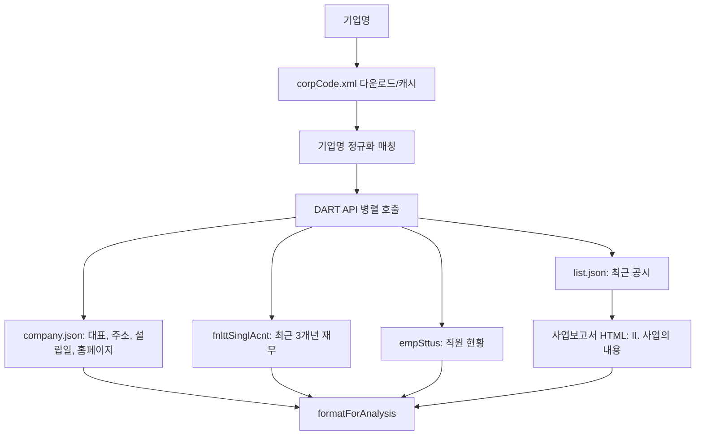

# 기업 분석 데이터 파이프라인

## 목적

이 문서는 ResearchAI가 기업 분석을 만들 때 데이터를 어떻게 수집하고, 정제하고, AI 분석 입력으로 조립한 뒤 저장하는지 정리한다. 초점은 화면 기능이 아니라 크롤링, 외부 API 연동, 데이터 정제, 저장까지 이어지는 데이터 파이프라인이다.

## 관련 코드

| 영역 | 파일 |
|------|------|
| 분석 API/SSE | `BE/src/company/presentation/company-analysis.controller.ts` |
| 분석 실행 | `BE/src/company/application/company-analysis.service.ts` |
| 큐 기반 분석 실행 | `BE/src/queue/application/job/company-analysis-executor.service.ts` |
| 검색 결과 정제 유틸 | `BE/src/company/application/company-analysis.utils.ts` |
| 기업 기본정보 보강 | `BE/src/company/application/company.service.ts` |
| 기업 보강 큐 | `BE/src/company/application/company-enrich-queue.service.ts` |
| DART 연동 | `BE/src/company/infrastructure/dart-financial.service.ts` |
| DART 요청 직렬화/캐시 | `BE/src/company/infrastructure/dart-api-queue.service.ts` |
| 잡플래닛 리뷰 크롤링 | `BE/src/company/infrastructure/jobplanet-scraper.service.ts` |
| 잡코리아/자소설/잡플래닛 공개정보 | `BE/src/company/infrastructure/*company.service.ts` |
| 나무위키 보조 크롤링 | `BE/src/company/infrastructure/namu-wiki.service.ts` |
| 부동산 시세 보조 데이터 | `BE/src/company/infrastructure/neonet-real-estate-price.service.ts` |

## 전체 흐름



분석 요청은 `POST /company-analysis/analyze`로 들어오고, 컨트롤러는 `text/event-stream`으로 진행 상태를 반환한다. 큐에서 실행되는 경우에는 `CompanyAnalysisExecutorService`가 동일한 `analyzeStream`을 호출하고 실패 시 최대 2회 재시도한다.

## 1. 검색 기반 자료 수집

`CompanyAnalysisService.analyzeStream`은 기업명을 기준으로 여러 검색 쿼리를 순차 실행한다. 검색은 `WebSearchService.runSearch`를 통해 수행하고, 검색 공급자는 `duckduckgo`, `tavily`, `serper`, `naver`, `brave` 중 사용 가능한 결과를 사용한다.

| 수집 항목 | 검색 목적 | 후속 처리 |
|-----------|-----------|-----------|
| 인재상/핵심가치/채용 공식 자료 | 기업이 요구하는 역량과 조직문화 파악 | `evidence` 출처 후보로 저장 |
| 최근 뉴스 | 기업의 최근 이슈와 사업 맥락 파악 | 뉴스성 URL만 필터링 후 AI가 카테고리/요약 보강 |
| 사업부문/매출비중 | 사업보고서, 연결재무, 사업부문 자료 보완 | `segmentContext`, `segmentSources`로 전달 |
| 직무소개 | 공식 채용 페이지의 직무별 설명 확보 | 기업 프로파일의 직무소개 근거로 사용 |
| 채용 공고 | 채용 중인 직무/공고 URL 확보 | `jobPostings`로 저장 |
| 경쟁사 후보 | 경쟁사명을 AI가 임의 생성하지 않도록 후보 근거 확보 | 출처 URL과 본문에 모두 존재하는 경쟁사만 통과 |
| 기술 조직/HRD 신호 | 테크 블로그, GitHub, 컨퍼런스, 기술스택, 인터뷰 탐색 | `hrTechContext`, `hrTechSources`로 HR 분석에 우선 반영 |

검색 결과는 `parseSearchLinks`로 제목/URL을 추출하고, `cleanSearchTitle`, `isBadNewsTitle`, `isJobPosting`, `isLikelyNewsArticle`, `isNaverBlog`로 정제한다. 네이버 블로그처럼 근거 품질이 낮거나 중복/잡음이 많은 출처는 분석 출처에서 제외한다.

## 2. 크롤링 기반 자료 수집

### 공식 웹사이트 탐색

`JobplanetScraperService.findOfficialWebsite`는 Puppeteer로 네이버 검색 결과를 열어 기업 공식 홈페이지를 찾는다.

- 1차: 네이버 지식패널의 홈페이지/공식 사이트 링크 탐색
- 2차: `"기업명 공식 홈페이지"` 검색 결과에서 외부 도메인 탐색
- 제외 도메인: 포털, SNS, 위키, 채용 플랫폼, 언론사 등

공식 사이트는 이후 HR/기술 조직 검색 쿼리에서 `site:{officialHost}` 조건으로 활용된다.

### 잡플래닛 리뷰 크롤링

`JobplanetScraperService.scrapeCompany`는 잡플래닛 계정 정보가 있을 때만 동작한다.

1. Puppeteer 실행
2. 저장된 세션 또는 계정 정보로 로그인
3. 잡플래닛 검색 페이지에서 기업 상세 URL 탐색
4. 리뷰 페이지로 이동
5. 스크롤을 내려 지연 로딩 리뷰를 유도
6. 본문 텍스트에서 평점, 리뷰 수, 복지/워라밸/조직문화, 개별 리뷰 장단점 추출

추출 결과는 `formatForAnalysis`로 AI 입력에 맞게 변환된다. 구조화 파싱이 실패하면 원문 일부를 `rawSummary`로 전달해 AI가 직접 분석할 수 있게 한다. 분석 후에는 `company_rate`에 평점, 리뷰 수, 세부 평점, 리뷰 요약을 저장한다.

### 기업 기본정보 보조 크롤러

기업 목록과 기본정보 보강은 `CompanyService.findOrCreate`와 `CompanyEnrichQueueService`가 담당한다. 분석 리포트 생성 과정에서 새 기업이 발견되면 `findOrCreate`가 실행되고, 이때 여러 소스가 병렬 조회된다.

| 소스 | 방식 | 수집 필드 |
|------|------|-----------|
| 나무위키 | Puppeteer 렌더링 후 카테고리/본문 파싱 | 기업 규모, 직원 수, 설립연도 |
| 잡코리아 | DuckDuckGo로 기업정보 URL 탐색 후 HTML 파싱 | 기업 규모, 직원 수, 설립일, 산업, 주소, 홈페이지 |
| 자소설닷컴 | Puppeteer 렌더링 후 검색 결과 파싱 | 기업 규모, 직원 수, 설립일, 주소, 산업 |
| 잡플래닛 공개정보 | DuckDuckGo로 기업 URL 탐색 후 렌더링/본문 파싱 | 기업 규모, 직원 수, 산업 |
| 잡플래닛 캐시 | 기존 `company_rate.summary` 정규식 파싱 | 기업 규모 보완 |

이 보강 파이프라인은 기업 분석 리포트 자체와 별개로 `companies` 테이블의 기본 프로필 품질을 높이는 역할을 한다.

## 3. 외부 API 연동

### DART OpenAPI

`DartFinancialService.fetchCompanyData`는 사용자의 DART API 키가 있을 때 실행된다. DART는 회사 하나를 분석할 때도 여러 API를 호출하므로 `DartApiQueueService`가 회사 단위로 직렬화하고 최소 1초 간격을 유지한다. 결과는 24시간 메모리 캐시된다.



DART에서 수집하는 주요 데이터는 다음과 같다.

| 데이터 | 내용 |
|--------|------|
| 기업 개요 | 기업코드, 종목코드, 상장구분, 대표자, 설립일, 홈페이지, 주소 |
| 재무 | 최근 3개년 매출액, 영업이익, 당기순이익, 영업이익률, 자본금 |
| 직원 | 최근 1~2개년 총원, 정규직/계약직, 성별 인원, 평균 근속, 평균 급여 |
| 공시 | 최근 공시 목록과 사업보고서 접수번호 |
| 사업 내용 | 사업보고서 HTML에서 `II. 사업의 내용` 섹션과 테이블 일부 추출 |

DART 원자료는 `formatForAnalysis`를 거쳐 AI 컨텍스트에 들어가고, 구조화된 일부 값은 `companies`, `company_financial`, `company_analyses`에 나누어 저장된다.

### 부동산 시세 보조 데이터

DART 주소가 있으면 `NeonetRealEstatePriceService`가 주소에서 시/구/군을 추출하고, 지원 지역의 아파트 매매/전세 시세를 조회한다.

- 주소 정제: 오탈자 보정, 광역 단위와 구/시/군 추출
- 지역 코드 매핑: 서울 주요 구와 일부 지원 지역
- 크롤링 대상: Neonet 아파트 매물 페이지
- 정제 결과: 평균/최소/최대 매매가, 평균/최소/최대 전세가, 단지 수
- 연결 URL: `ZippoomRealEstateUrlService`가 지역별 부동산 URL 생성

이 데이터는 기업 분석의 부가 정보로 `apartmentPrices`에 저장된다.

## 4. 데이터 정제와 병합 규칙

### 기업명 정규화

기업 키는 공백, 괄호, 법인 표기, 특수문자를 제거하고 소문자로 변환한다.

- 분석 키: `CompanyAnalysisService.normalizeKey`
- 기업 목록 키: `CompanyService.normalizeName`
- 크롤러 검색명: `CompanyService.cleanSearchName`

이 정규화 덕분에 `삼익 THK`, `삼익THK`, `(주)삼익THK` 같은 입력을 같은 기업으로 묶을 수 있다.

### 검색 결과 정제

검색 원문은 제목과 출처 URL을 분리한 뒤 다음 기준으로 걸러낸다.

- HTML 엔티티와 태그 제거
- 깨진 제목, 너무 짧은 제목 제거
- 채용 공고와 뉴스의 목적별 분리
- 뉴스/언론 URL 패턴 필터링
- 네이버 블로그 제외
- URL 끝의 구두점/괄호 제거
- URL 기준 중복 제거

### 외부 소스 병합 우선순위

`CompanyService.mergeSources`는 기업 기본정보를 아래 우선순위로 병합한다.

| 우선순위 | 소스 |
|----------|------|
| 100 | DART |
| 80 | 나무위키 |
| 70 | 잡코리아 |
| 60 | 자소설닷컴 |
| 55 | 잡플래닛 리뷰 캐시 |
| 50 | 잡플래닛 공개정보 |
| 30 | 채용 사이트에서 전달된 값 |
| 10 | 수동 입력 |

기업 규모처럼 소스 간 충돌 가능성이 큰 값은 더 높은 우선순위의 값을 사용한다. 직원 수, 주소, 홈페이지, 대표자, 설립일, 산업처럼 비어 있는 필드는 새로운 소스 값으로 보완한다. 실제 사용된 소스 목록은 `companies.sources`에 누적한다.

### 경쟁사 검증

경쟁사는 AI가 만든 이름을 그대로 저장하지 않는다. `isVerifiedCompetitor`가 다음 조건을 모두 만족하는 경우만 `competitors`에 저장한다.

- 경쟁사명이 비어 있지 않을 것
- 분석 대상 기업명과 같지 않을 것
- `marketScope`가 있을 것
- `sourceUrl`이 있을 것
- 해당 URL이 크롤링된 경쟁사 출처 목록에 있을 것
- 경쟁사명이 크롤링 본문 또는 출처 제목에 실제로 등장할 것

이 규칙은 경쟁사 목록이 그럴듯하지만 근거 없는 데이터로 오염되는 것을 막는다.

### AI JSON 복구와 파싱

AI 응답은 JSON을 기대하지만, 실제 응답에는 코드블록, 제어문자, 이스케이프 오류가 섞일 수 있다.

`parseAiJson`은 다음 순서로 복구한다.

1. JSON 코드블록 표기 제거
2. 첫 `{`부터 마지막 `}`까지 JSON 후보 추출
3. 문자열 내부 줄바꿈/탭을 `repairJsonStr`로 이스케이프
4. 붙어 있는 객체 사이 쉼표 보정
5. 역슬래시가 섞인 따옴표 패턴 보정
6. 실패 시 오류 위치 주변 로그 출력

## 5. AI 분석 컨텍스트 구성

수집된 데이터는 하나의 `userPrompt`로 묶인다. 컨텍스트는 원자료 성격별 섹션을 유지한다.

```text
오늘 날짜: YYYY-MM-DD

## 분석 대상: 기업명

## 인재상·채용 자료
...

## 직무소개 자료
...

## 사업부문·종속회사 자료
...

## 경쟁사 후보 크롤링 자료
...

## 기술 조직·HRD 신호 크롤링 자료
...

## DART 재무 데이터
...

## 잡플래닛 기업 리뷰 데이터
...

## 최근 뉴스 목록
...
```

이 컨텍스트는 `sourceContext`로 함께 저장된다. 이후 기업 분석 챗봇이나 근거 확인에서 당시 AI가 어떤 원자료를 보고 답했는지 추적할 수 있다.

## 6. AI 분석 작업 분리

AI 호출은 하나의 거대한 프롬프트가 아니라 네 가지 작업으로 병렬 분리된다.

| 작업 | 프롬프트 | 산출물 |
|------|----------|--------|
| 역량/조직문화 평가 | `SYSTEM_PROMPT_SCORING` | 핵심 역량 점수, 점수 근거, 요약, SWOT, 산업/기업 규모/신용등급 |
| 사업 분석 | `SYSTEM_PROMPT_BUSINESS` | 경쟁사, 사업부문, 기업 프로파일, 미션/비전/인재상 |
| 보고서 | `SYSTEM_PROMPT_REPORT` | 기업 분석 보고서, 뉴스 카테고리/요약 |
| HR 분석 | `SYSTEM_PROMPT_HR` | HR Wheel, 경쟁가치모델, 울리치 모델, 하버드 모델, 채용 페이지 URL |

토큰 사용량과 추정 비용은 네 호출 결과를 합산해 저장한다. 필수에 가까운 `scoring` 호출이 실패하면 전체 분석을 실패 처리하고, 나머지 호출 실패는 로그로 남기고 가능한 범위에서 부분 결과를 저장한다.

## 7. 저장 구조

분석 결과는 목적에 따라 여러 테이블에 나누어 저장된다.

| 테이블 | 역할 |
|--------|------|
| `company_analyses` | 기업 분석 리포트 본문, 점수, 근거, SWOT, 경쟁사, 사업부문, 뉴스, 채용공고, HR 분석, 원자료 컨텍스트 |
| `companies` | 기업 기본 프로필, 정규화 이름, 기업 규모, 직원 수, 홈페이지, 주소, 대표자, 설립일, 산업, DART URL |
| `company_financial` | DART 기반 재무 요약, 다년도 재무, 공시, 직원 상세 |
| `company_rate` | 잡플래닛 리뷰/평점/조직문화 요약 |
| `company_enrich_queue` | 기업 기본정보 보강 대기열 |

저장 후에는 `toDto`가 `company_analyses`, `companies`, `company_financial`, `company_rate`를 조합해 `CompanyAnalysisDto`로 반환한다.

## 8. 큐, 캐시, 실패 대응

### 요청 직렬화와 캐시

외부 서비스는 과도한 요청에 취약하므로 일부 소스는 자체 큐와 캐시를 갖는다.

| 서비스 | 제어 방식 |
|--------|-----------|
| DART | 회사 단위 직렬화, 최소 1초 간격, 24시간 캐시 |
| 잡코리아 | 최소 2초 간격, 24시간 캐시 |
| 자소설닷컴 | 최소 3초 간격, 24시간 캐시 |
| 잡플래닛 공개정보 | 최소 3초 간격, 24시간 캐시 |
| 나무위키 | 최소 3초 간격, 24시간 캐시 |
| 기업 보강 큐 | 미처리 항목 서버 재시작 후 재개, 최대 3회 시도 |

### 부분 실패 허용

대부분의 외부 수집은 실패해도 전체 분석을 즉시 중단하지 않는다.

- DART 키가 없으면 재무/공시 수집을 건너뛴다.
- 잡플래닛 계정이 없으면 리뷰 수집을 건너뛴다.
- 특정 검색 쿼리나 크롤러가 실패하면 해당 컨텍스트만 비운다.
- DART 내부 API는 `Promise.allSettled`로 일부 실패를 허용한다.
- AI `scoring`은 필수로 보고, 나머지 AI 작업은 부분 실패를 허용한다.

## 9. 데이터 품질상 주의점

- 검색 결과는 검색 엔진 스니펫과 링크에 의존하므로 최신성/정확성이 항상 보장되지는 않는다.
- 잡플래닛, 자소설닷컴, 나무위키는 렌더링 구조나 차단 정책이 바뀌면 파싱 실패 가능성이 높다.
- 기업명 정규화는 동명이인/계열사/해외 법인을 완벽히 구분하지 못한다.
- 경쟁사는 출처 검증을 거치지만, 시장 범위나 경쟁 강도는 AI 판단이 포함된다.
- 부동산 시세는 DART 주소와 지원 지역 코드가 있어야만 생성된다.
- `sourceContext`는 근거 추적에 중요하므로 분석 저장 시 반드시 유지해야 한다.

## 개선 방향

- 외부 소스별 `fetchedAt`, `sourceUrl`, `confidence`를 구조화해 저장한다.
- 검색 스니펫이 아니라 원문 본문 fetch/요약 단계를 별도 파이프라인으로 분리한다.
- DART 사업보고서 파싱 결과를 사업부문 테이블, 본문, 시설/종속회사로 구조화한다.
- 크롤러별 실패 원인을 `blocked`, `not_found`, `parse_failed`, `timeout`으로 구분한다.
- AI 산출물마다 사용한 출처 ID를 남겨 UI에서 근거를 직접 열 수 있게 한다.
- 기업명 후보 매칭에 사업자번호, DART corpCode, 공식 도메인을 함께 사용해 계열사 혼동을 줄인다.
