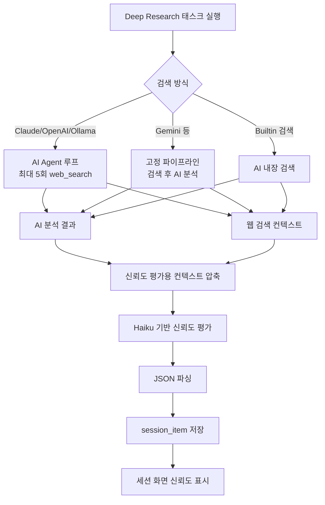
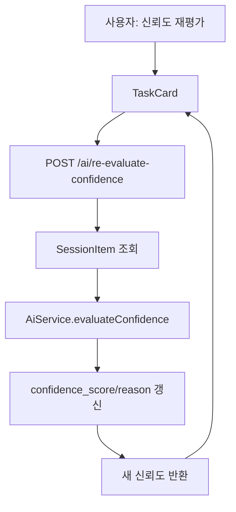

# Research AI 신뢰성 평가

## 목적

Research 기능은 사용자가 만든 리서치 태스크마다 웹 검색과 AI 분석 결과를 저장한다. 이 문서는 Deep Research 결과의 신뢰도를 어떻게 평가하고, 어디에 저장하며, 화면에서 어떻게 표시하는지 정리한다.

여기서 신뢰도는 "답변이 절대적으로 참인지"를 보증하는 값이 아니다. 현재 구현에서의 신뢰도는 AI 답변이 검색 소스와 얼마나 직접적으로 연결되어 있고, 여러 출처로 교차 검증되며, 불확실성을 잘 드러내는지를 평가한 품질 신호다.

## 관련 코드

| 영역 | 파일 |
|------|------|
| Deep Research 실행 | `BE/src/research/application/pipeline/deep-research-pipeline.service.ts` |
| 신뢰도 모델 타입 | `BE/src/research/domain/model/confidence.model.ts` |
| 리서치 프롬프트 | `BE/src/research/domain/prompt/research.prompts.ts` |
| 신뢰도 평가 호출 | `BE/src/ai/application/ai.service.ts` |
| 신뢰도 재평가 API | `BE/src/ai/presentation/ai.controller.ts` |
| Deep Research 큐 실행 | `BE/src/queue/application/job/deep-research-executor.service.ts` |
| 세션 태스크 저장 | `BE/src/sessions/domain/entity/session-item.entity.ts` |
| 세션 상세 표시 | `FE/app/sessions/components/TaskCard.tsx` |
| 상세 패널 표시 | `FE/app/sessions/components/TaskPanel.tsx` |

## 전체 흐름



## 1. 분석 결과 생성 단계

신뢰도 평가는 Deep Research 분석이 끝난 뒤 후처리 단계로 실행된다.

`DeepResearchPipelineService.run`은 모델과 웹 검색 방식에 따라 세 가지 실행 경로 중 하나를 사용한다.

| 실행 경로 | 조건 | 신뢰도 평가에 넘어가는 근거 |
|-----------|------|------------------------------|
| AI Agent 루프 | Claude, OpenAI, Ollama 계열 | AI가 호출한 `web_search` 결과의 `searchLog` |
| 고정 파이프라인 | Gemini 등 에이전트 루프를 쓰지 않는 모델 | 사전에 실행한 웹 검색 결과 |
| 내장 검색 | 벤더 내장 검색 사용 | 모델이 반환한 검색 로그 |

분석 답변은 `aiResult`로 저장되고, 검색 결과는 `webSources`와 `searchLog`로 보관된다. 큐 실행 시 `DeepResearchExecutorService`가 이 값을 받아 `session_item`에 저장한다.

## 2. 신뢰도 평가 입력 구성

신뢰도 평가는 원본 검색 컨텍스트 전체를 그대로 넣지 않는다. `compressContext`가 출처 블록별 본문을 최대 400자로 자른 뒤 평가 모델에 전달한다.

압축 규칙은 다음과 같다.

- 검색 결과를 `[제목]` 블록 단위로 나눈다.
- 각 블록에서 `출처:` URL을 보존한다.
- 본문은 최대 400자로 제한한다.
- 제목, 요약 본문, URL만 남겨 평가 비용과 토큰을 줄인다.

이 압축은 신뢰도 평가에만 사용된다. 실제 Deep Research 분석 단계에는 원본 검색 컨텍스트가 전달된다.

## 3. 평가 모델과 프롬프트

현재 자동 신뢰도 평가는 고정 모델을 사용한다.

```typescript
private static readonly CONFIDENCE_MODEL = 'claude-haiku-4-5-20251001';
```

평가는 `AiService.evaluateConfidence`에서 실행된다. 입력은 AI 답변과 압축된 웹 검색 소스이며, 출력은 JSON 하나로 제한한다.

```typescript
interface ConfidenceScore {
  score: number;  // 0~100
  reason: string; // 점수 근거
}
```

평가 기준은 네 가지다.

| 기준 | 의미 |
|------|------|
| 출처 수와 다양성 | 서로 다른 출처가 충분한지 본다. |
| 교차 검증 일치도 | 여러 소스가 같은 사실을 지지하는지 본다. |
| 불확실 표현 비율 | 답변이 과도하게 추정하거나 애매한 표현에 기대는지 본다. |
| 검색 결과와 답변의 직접 연관성 | 답변의 주장과 검색 결과가 직접 연결되는지 본다. |

평가 프롬프트는 순수 JSON만 반환하도록 요구한다.

```json
{
  "score": 0,
  "reason": "점수 근거를 1~2문장으로 한국어 설명"
}
```

## 4. 검색 결과가 없을 때

검색 컨텍스트가 없는 경우에는 평가 모델을 호출하지 않고 기본 신뢰도를 부여한다.

```typescript
{
  score: 50,
  reason: "검색 결과 없이 AI 자체 지식으로 답변하여 신뢰도를 측정할 수 없습니다."
}
```

이 값은 중립값에 가깝다. 검색 근거가 없어 낮게 확정하지도, 높게 보증하지도 않는 상태를 나타낸다.

## 5. JSON 파싱 실패 처리

신뢰도 평가 모델이 JSON이 아닌 응답을 반환하거나 파싱에 실패하면 50점을 반환한다.

```typescript
{
  score: 50,
  reason: "신뢰도 평가 중 오류가 발생했습니다. ..."
}
```

FE는 `reason`이 `신뢰도 평가 중 오류`로 시작하면 일반 점수 UI 대신 평가 실패 상태로 보여준다.

## 6. 저장 구조

Deep Research가 완료되면 `DeepResearchExecutorService`가 분석 결과, 검색 결과, 신뢰도를 함께 저장한다.

| 컬럼 | 내용 |
|------|------|
| `session_item.ai_result` | AI가 작성한 마크다운 분석 결과 |
| `session_item.web_result` | 대표 웹 검색 결과 텍스트 |
| `session_item.search_log` | 에이전트 루프 또는 검색 단계의 쿼리/결과 JSON |
| `session_item.used_web_model` | 사용된 웹 검색 엔진 |
| `session_item.confidence_score` | 0~100 신뢰도 점수 |
| `session_item.confidence_reason` | 신뢰도 평가 근거 |
| `session_item.input_tokens` | 분석 모델 입력 토큰 |
| `session_item.output_tokens` | 분석 모델 출력 토큰 |
| `session_item.estimated_fees` | 분석 모델 예상 비용 |

세션 조회 DTO에서는 `confidenceScore`와 `confidenceReason`을 `{ score, reason }` 형태로 합쳐 FE에 전달한다.

## 7. 화면 표시

세션 화면에서는 태스크 카드와 상세 패널에 신뢰도 점수를 표시한다.

| 점수 구간 | 표시 색상 | 의미 |
|-----------|-----------|------|
| 71~100 | 녹색 | 출처 기반 근거가 비교적 충분함 |
| 41~70 | 노란색 | 일부 근거는 있으나 부족하거나 불확실함 |
| 0~40 | 빨간색 | 근거 부족, 교차 검증 부족, 답변-출처 연결 약함 |

`TaskCard`는 배터리 형태의 작은 게이지로 점수를 보여주고, 상세 탭에서는 점수 막대와 평가 근거 문장을 함께 표시한다.

## 8. 신뢰도 재평가

완료된 태스크는 FE에서 신뢰도 재평가를 실행할 수 있다.



재평가는 기존에 저장된 `aiResult`와 `webResult`를 다시 평가한다. 사용자는 재평가 모델을 선택할 수 있고, 결과는 `SessionItemCommandService.updateConfidence`를 통해 DB에 반영된다.

## 9. 답변 생성 단계의 신뢰성 보강

신뢰도 점수는 사후 평가지만, 답변 생성 프롬프트 자체에도 신뢰성 제약이 들어 있다.

Deep Research 시스템 프롬프트는 다음을 요구한다.

- 제공된 정보를 비판적으로 분석한다.
- 출처, 신뢰도, 최신성을 고려한다.
- 불확실하거나 상충하는 정보는 명시한다.
- 주장에는 근거를, 수치에는 출처를 함께 제시한다.
- 검색 결과에 없는 수치, 통계, 사실은 작성하지 않는다.
- 검색 결과에서 확인할 수 없는 내용은 `확인되지 않음` 또는 생략으로 처리한다.
- 사실, 수치, 주장을 서술한 문장 끝에 출처 URL을 인용한다.

즉 Research의 신뢰성 관리는 두 단계로 구성된다.

1. 답변 생성 전/중: 검색 결과 안에서만 답하도록 프롬프트로 제한한다.
2. 답변 생성 후: 답변과 검색 소스를 다시 비교해 신뢰도 점수를 만든다.

## 10. 한계와 주의점

- 신뢰도 평가는 또 다른 AI 호출이므로 평가 자체도 완전한 검증기는 아니다.
- 현재 점수는 출처 기반 품질 평가이지 사실 검증 결과가 아니다.
- 검색 컨텍스트를 400자 단위로 압축하기 때문에 긴 원문에 있는 중요한 근거가 평가 단계에서 빠질 수 있다.
- `re-evaluate-confidence`는 저장된 `webResult`만 사용하므로, 에이전트 루프의 전체 `searchLog`보다 근거가 적게 들어갈 수 있다.
- 출처가 많아도 같은 내용을 베낀 보도자료나 중복 기사라면 실제 다양성은 낮을 수 있다.
- 검색 엔진 결과 자체가 오래되었거나 잘못되면 신뢰도 평가도 영향을 받는다.

## 개선 방향

- 신뢰도 평가 입력에 `searchLog` 전체와 출처별 URL을 구조화해서 전달한다.
- 출처 URL의 도메인, 발행일, 원문 길이, 중복도를 별도 특징값으로 계산한다.
- AI 점수와 규칙 기반 점수를 분리해 `sourceCoverage`, `crossCheck`, `citationQuality`, `freshness` 같은 하위 점수를 저장한다.
- 검색 결과와 답변 문장 사이의 URL 인용 매칭률을 자동 계산한다.
- 같은 사실을 지지하는 출처 묶음과 충돌하는 출처 묶음을 UI에 보여준다.
- 재평가 시 최신 웹 검색을 다시 수행할지, 기존 저장 근거만 사용할지 옵션을 분리한다.
