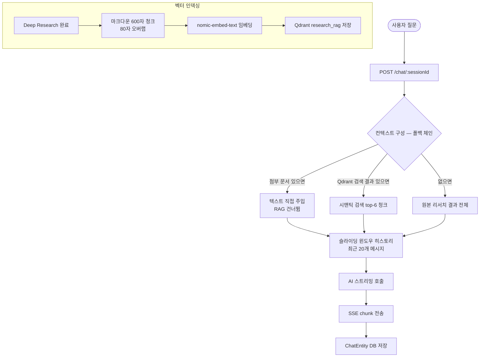

# RAG 채팅 파이프라인

리서치 세션 결과를 벡터 검색해 AI 답변을 생성합니다.

---

## API

```
POST /chat/{sessionId}
Body: { message, model, attachedTexts? }
SSE Response:
  { type: 'chunk', text: string }
  { type: 'done' }

DELETE /chat/{sessionId}  # 채팅 히스토리 초기화
```

---

## 흐름



---

## 컨텍스트 구성 우선순위

1. **첨부 문서** — PDF 등 파일을 채팅에 첨부하면 텍스트를 직접 프롬프트에 주입 (RAG 우회)
2. **Qdrant 시맨틱 검색** — `research_rag` 컬렉션에서 질문과 유사한 청크 top-6 반환
3. **원본 결과 전체** — Qdrant 미설정 또는 결과 없을 때 폴백

---

## 채팅 메시지 저장

`ChatEntity`에 2종류의 컨텐츠가 저장됩니다:

| 필드 | 내용 |
|------|------|
| `content` | 실제 사용자 메시지 or AI 응답 (FE 표시용) |
| `context_message` | RAG 보강된 전체 프롬프트 (내부 히스토리용) |

→ AI는 `context_message`를 히스토리로 사용해 문맥을 유지합니다.

---

## 컨텍스트 압축 (Compaction)

세션 채팅이 길어지면 자동으로 이전 대화를 압축합니다.

- 트리거: 히스토리 20개 초과 & 모든 태스크 완료
- Ollama 로컬 모델로 이전 대화 요약
- 요약본을 시스템 프롬프트에 추가
- FE에서 압축 상태 표시 (`compactionStatus`)
