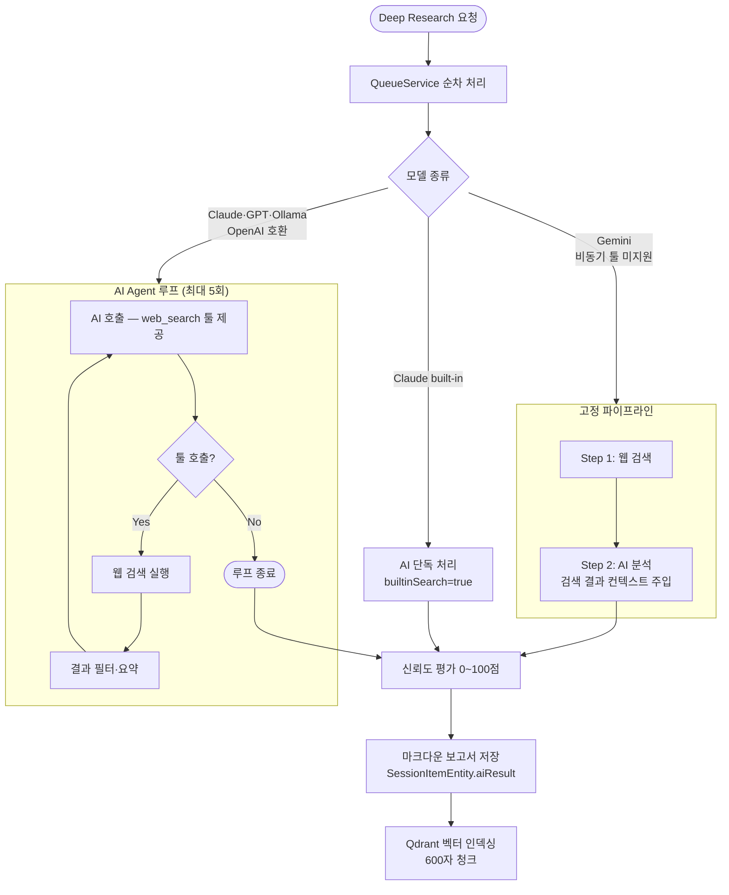

# Deep Research 파이프라인

태스크별 심층 분석. 큐에서 순차 처리.

---

## API

```
POST /queue/research/{sessionId}/deep
Body: { itemIds?, cloudAiModel, webModel, filterModel }
→ { status, sessionId }

DELETE /queue/research/{sessionId}/deep          # 전체 취소
DELETE /queue/research/{sessionId}/deep/items/{itemId}  # 개별 취소
```

---

## 흐름



---

## 실행 모드 선택 기준

| 모드 | 적용 조건 |
|------|----------|
| AI Agent 루프 | Claude, GPT, Ollama (tool_use 지원) |
| 고정 파이프라인 | Gemini (기본 키 사용 시) |
| 내장 검색 | Claude (`web_search_20250305` 툴) |

---

## 신뢰도 평가

AI가 결과물을 0~100점으로 평가합니다.

```typescript
interface Confidence {
  score: number;   // 0-100
  reason: string;  // 평가 근거
}
```

- 출처 명시, 교차 검증 여부, 정보 최신성 기준
- `/sessions/[id]` → 카드별 신뢰도 배지로 표시
- 전체 재평가: `SessionHeader` → "신뢰도 재평가" 버튼

---

## 출력 저장

| 위치 | 내용 |
|------|------|
| `SessionItemEntity.aiResult` | 마크다운 보고서 |
| `SessionItemEntity.webResult` | 웹 검색 원본 |
| `SessionItemEntity.confidence` | JSON `{ score, reason }` |
| `SessionItemEntity.status` | `done` \| `error` |
| Qdrant `research_rag` | 벡터 청크 (RAG용) |
