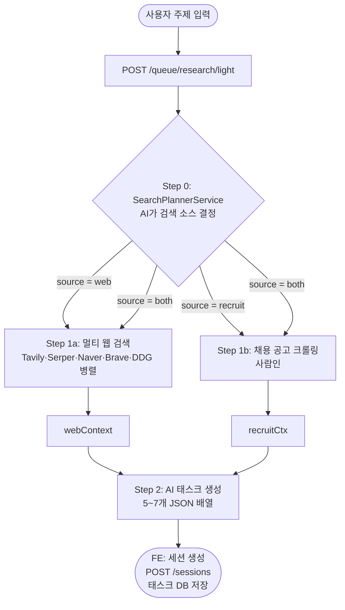

# Light Research 파이프라인

주제(topic) → 리서치 태스크 목록 자동 생성.

---

## API

```
POST /queue/research/light
Body: { topic, cloudAiModel, webModel, attachedTexts? }
→ { searchId }

GET /queue/research/light/{searchId}/stream  (SSE)
```

---

## 흐름



---

## Step 0 — 검색 소스 판단

`SearchPlannerService`가 주제를 분석해 검색 소스를 결정합니다.

| 결과 | 의미 |
|------|------|
| `web` | 일반 웹 검색만 |
| `recruit` | 채용 공고 크롤링만 |
| `both` | 둘 다 병렬 실행 |

- Ollama 모델 사용 (`OLLAMA_PLANNER_MODEL` 또는 `OLLAMA_MODEL`)
- 없으면 기본 AI 모델로 폴백

---

## Step 1a — 웹 검색

`WebSearchProvider`가 설정된 모든 엔진에 병렬로 요청합니다.

| 엔진 | API 키 | 특징 |
|------|--------|------|
| Tavily | `TAVILY_API_KEY` | AI 최적화, 고품질 |
| Serper | `SERPER_API_KEY` | Google 구조화 결과 |
| Naver | `NAVER_CLIENT_ID/SECRET` | 한국어 특화 |
| Brave | `BRAVE_API_KEY` | 독립 인덱스 |
| DuckDuckGo | 불필요 | HTML 파싱, 항상 사용 가능 |

각 결과에서 페이지 본문 최대 2000자 추출. 차단 도메인 필터(Tistory, 네이버 블로그·카페) 적용.

---

## Step 1b — 채용 공고 크롤링

사람인 API 파라미터 매핑:

| 필터 | 파라미터 |
|------|---------|
| 대기업 | `emp_tp=1` |
| 중견기업 | `emp_tp=2` |
| 중소기업 | `emp_tp=3` |
| 외국계 | `emp_tp=4` |
| 공기업 | `emp_tp=5` |
| 스타트업 | `emp_tp=6` |
| 신입 | `career_cd=1` |
| 경력 | `career_cd=2` |
| 인턴 | `job_type=3` |

---

## Step 2 — 태스크 생성

수집된 컨텍스트를 AI에 전달해 태스크 목록(JSON 배열)을 생성합니다.

```json
[
  { "id": 1, "title": "시장 현황 분석", "icon": "📊", "prompt": "..." },
  { "id": 2, "title": "경쟁사 비교", "icon": "🔍", "prompt": "..." }
]
```

생성된 태스크는 `SessionItemEntity`로 DB에 저장됩니다.
