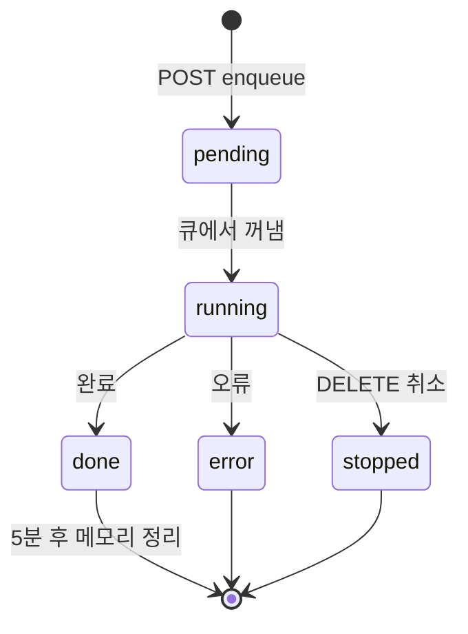

# 큐 시스템

## 개요

모든 비동기 AI 작업은 인-메모리 큐를 통해 처리됩니다. 완료된 작업은 DB(`queue_jobs`)에 영속화됩니다.

- 최대 동시 실행: **3개** (`MAX_CONCURRENCY`)
- 완료 후 TTL: **5분** (메모리 정리)
- 서버 재시작 시 1시간 이상 된 running 상태 작업은 STOPPED으로 복구

---

## 작업 흐름



---

## 클라이언트 패턴

```
1. POST /queue/{작업종류}        →  { jobId }
2. GET  /queue/{작업종류}/{jobId}/stream  (SSE 연결)
3. DELETE /queue/{작업종류}/{jobId}  (취소)
```

또는 전역 WebSocket 구독:

```
WS ws://localhost:3001/ws
  subscribe: session:{sessionId}
  → 큐 상태 변경 이벤트 수신
```

---

## TaskType 목록

| TaskType | 엔드포인트 | Executor |
|----------|-----------|----------|
| `LIGHTRESEARCH` | `POST /queue/research/light` | LightResearchExecutorService |
| `DEEPRESEARCH` | `POST /queue/research/:sessionId/deep` | DeepResearchExecutorService |
| `SUMMARY` | `POST /queue/summary/:sessionId` | SummaryExecutorService |
| `WRITEASSIST` | `POST /queue/write-assist` | WriteAssistExecutorService |
| `COMPANYPROFILE` | `POST /queue/company-profile` | CompanyProfileExecutorService |

---

## SSE 이벤트 타입

```typescript
type SseEvent =
  | { type: 'log';   message: string }       // 진행 로그
  | { type: 'chunk'; text: string }          // AI 스트리밍 조각
  | { type: 'done';  result?: any }          // 완료 + 결과
  | { type: 'error'; message: string }       // 오류
  | { type: 'sync';  jobs: QueueJob[] }      // 전체 큐 스냅샷 (WebSocket)
```

---

## QueueJob 구조

```typescript
interface QueueJob {
  jobId: string;
  sessionId?: string;
  itemId?: string;
  taskType: TaskType;
  status: 'pending' | 'running' | 'done' | 'error' | 'stopped';
  phase?: 'searching' | 'analyzing';
  result?: string;
  error?: string;
  createdAt: Date;
}
```

---

## Light Research SSE 이벤트

Light Research는 추가 이벤트 타입을 사용합니다:

```typescript
{ type: 'log',  message: string }
{ type: 'plan', source: 'web' | 'recruit' | 'both', keyword, companyTypes, jobTypes }
{ type: 'done', tasks: Task[], searchPlan }
```

`tasks` 구조:
```typescript
{ id: number, title: string, icon: string, prompt: string }
```
