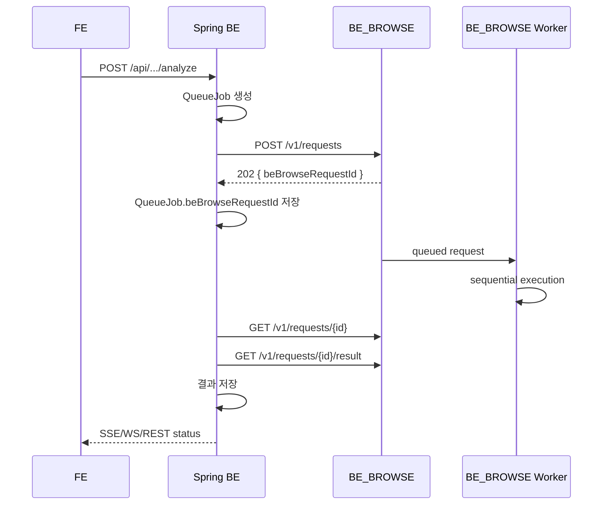

# BE / BE_BROWSE 연결 설계

작성일: 2026-06-01

## 목적

`CONNECT`는 Spring `BE`와 Python `BE_BROWSE`가 어떻게 연결되는지 정의한다.

| 서버 | 역할 |
|------|------|
| BE | public API, auth, DB, domain CRUD, queue orchestration, FE event |
| BE_BROWSE | search engine, browser/crawling, AI tools, OCR/RAG 실행, internal request queue |

FE는 BE_BROWSE를 직접 호출하지 않는다. FE는 항상 BE를 호출한다.

## 기본 흐름

```text
FE
-> Spring BE public API
-> Spring QueueJob 생성
-> BE_BROWSE /v1/requests enqueue
-> beBrowseRequestId 저장
-> BE_BROWSE sequential worker 실행
-> BE가 status/result polling 또는 event stream 수신
-> Spring DB 저장
-> FE에 SSE/WS/REST로 상태 전달
```



## ID 규칙

| ID | 소유 | 설명 |
|----|------|------|
| `jobId` | BE | FE에 노출되는 사용자-facing queue job ID |
| `requestId` | BE | Spring-generated correlation UUID |
| `beBrowseRequestId` | BE_BROWSE | BE_BROWSE 내부 실행 request UUID |
| `traceId` | infra | log/tracing correlation |

Spring `QueueJob`에는 최소한 `jobId`, `taskType`, `status`, `beBrowseRequestId`, `createdAt`, `updatedAt`을 저장한다.

## Request Contract

Spring BE -> BE_BROWSE 내부 요청은 version, correlation id, caller, user context를 가진다.

```json
{
  "version": "v1",
  "requestType": "search.company.analyze",
  "requestId": "spring-generated-correlation-uuid",
  "userId": "uuid-or-anon",
  "caller": "queue.company-analysis",
  "modelPolicy": {
    "cloudModel": "claude-sonnet-4-6",
    "localModel": "ollama:nomic-embed-text"
  },
  "credentialsRef": {
    "scope": "user",
    "keys": ["anthropic", "tavily"]
  },
  "payload": {}
}
```

응답:

```json
{
  "beBrowseRequestId": "uuid",
  "status": "queued",
  "queuedAt": "2026-06-01T00:00:00Z"
}
```

## BE_BROWSE API

| Method | Path | 역할 |
|--------|------|------|
| `POST` | `/v1/requests` | 작업 enqueue |
| `GET` | `/v1/requests/{beBrowseRequestId}` | 상태, progress, timestamps 조회 |
| `GET` | `/v1/requests/{beBrowseRequestId}/result` | 성공 결과 또는 artifact reference 조회 |
| `GET` | `/v1/requests/{beBrowseRequestId}/events` | 선택: progress stream |
| `POST` | `/v1/requests/{beBrowseRequestId}/cancel` | 취소 요청 |
| `GET` | `/health` | service health |

모든 실행 요청은 `/v1/requests`를 통해 enqueue한다. Compatibility wrapper가 있더라도 내부적으로는 enqueue만 수행한다.

## 상태 매핑

BE_BROWSE request status:

```text
queued
running
succeeded
failed
cancelled
expired
```

Spring QueueJob status:

```text
pending
running
done
error
stopped
cancelled
```

권장 매핑:

| BE_BROWSE | Spring QueueJob |
|-----------|-----------------|
| `queued` | `pending` |
| `running` | `running` |
| `succeeded` | `done` |
| `failed` | `error` |
| `cancelled` | `cancelled` |
| `expired` | `error` |

## Result Contract

작은 결과는 JSON으로 반환한다. 큰 HTML, PDF text, screenshot, OCR artifact, browser trace는 artifact key를 반환한다.

```json
{
  "beBrowseRequestId": "uuid",
  "status": "succeeded",
  "resultType": "company.analysis",
  "result": {},
  "artifacts": [
    {
      "type": "html",
      "key": "artifact/company/uuid/raw.html"
    }
  ]
}
```

Spring BE는 최종 사용자-facing 결과만 DB에 저장한다. raw artifact는 artifact store에 둔다.

## HTTP/2

Spring BE -> BE_BROWSE 내부 통신은 REST over HTTP/2를 목표로 한다.

```text
Spring BE
-> JDK HttpClient HTTP/2
-> BE_BROWSE FastAPI
```

권장:

- Spring BE client: JDK `HttpClient` HTTP/2 + Java 21 virtual thread executor
- BE_BROWSE server: Hypercorn HTTP/2 또는 Envoy/sidecar HTTP/2 front
- local: 필요 시 h2c 허용
- 운영/k8s: 내부 TLS 기반 HTTP/2 권장

초기 구현은 HTTP/1.1 compatible REST contract로 작성한다. transport만 HTTP/2로 올릴 수 있어야 한다.

## Spring Client

Spring은 WebFlux를 사용하지 않는다. Spring MVC + Java 21 virtual thread로 BE_BROWSE enqueue/status/result/cancel 호출을 수행한다.

필수 client method:

```java
public interface BeBrowseClientPort {
    BeBrowseEnqueueResult enqueue(BeBrowseRequest request);
    BeBrowseStatusResult getStatus(BeBrowseRequestId requestId);
    BeBrowseResult getResult(BeBrowseRequestId requestId);
    void cancel(BeBrowseRequestId requestId);
}
```

구현 후보:

```java
@Configuration
public class BeBrowseClientConfig {
    @Bean(destroyMethod = "close")
    ExecutorService beBrowseExecutor() {
        return Executors.newVirtualThreadPerTaskExecutor();
    }

    @Bean
    HttpClient beBrowseHttpClient(ExecutorService beBrowseExecutor) {
        return HttpClient.newBuilder()
                .version(HttpClient.Version.HTTP_2)
                .executor(beBrowseExecutor)
                .connectTimeout(Duration.ofSeconds(3))
                .build();
    }
}
```

## Progress

초기 구현은 polling을 기본으로 한다.

```text
BE worker
-> GET /v1/requests/{beBrowseRequestId}
-> status/progress 확인
-> 필요 시 FE에 SSE/WS로 전달
```

이후 `/v1/requests/{beBrowseRequestId}/events`로 progress stream을 붙일 수 있다.

## 보안

- BE_BROWSE는 ClusterIP 내부 서비스만 노출한다.
- FE나 외부 client가 BE_BROWSE를 직접 호출하지 않는다.
- BE_BROWSE에 raw API key를 장기 저장하지 않는다.
- 초기 구현에서는 Spring BE가 호출 시 복호화한 key를 short-lived request payload로 전달할 수 있다.
- 장기적으로는 short-lived secret envelope 또는 internal secret broker로 전환한다.
- 내부 요청은 service token 또는 mTLS를 사용한다.

## Retry / Timeout / Circuit Breaker

Spring BE:

- enqueue/status/result/cancel 호출에 timeout을 둔다.
- BE_BROWSE unavailable 시 Spring QueueJob은 error 또는 retryable 상태로 전환한다.
- 무제한 병렬 호출을 막기 위해 bulkhead/semaphore를 둔다.

BE_BROWSE:

- provider/search/browser adapter별 timeout을 둔다.
- provider fallback과 rate limit을 adapter 공통 policy로 분리한다.
- running 작업 취소는 best-effort cancellation으로 처리한다.

## 배포

| 대상 | Service | 공개 범위 |
|------|---------|-----------|
| Spring BE | `be:3001` | ingress `/api`, `/ws` |
| BE_BROWSE | `be-browse:8001` | ClusterIP internal only |

k8s 작업:

- `deploy/k8s/40-be.yaml`을 Spring BE용으로 교체
- `deploy/k8s/41-be-browse.yaml` 추가
- BE_BROWSE는 browser 메모리를 고려해 resource request/limit 분리
- Spring BE -> BE_BROWSE HTTP/2 활성화
- health/readiness/liveness probe 추가

## 연결 체크리스트

- [ ] BE_BROWSE `/health` 확인
- [ ] BE_BROWSE `/v1/requests` enqueue 확인
- [ ] `beBrowseRequestId` 반환 확인
- [ ] Spring `QueueJob.beBrowseRequestId` 저장
- [ ] 상태 polling 또는 event stream 전략 결정
- [ ] result 조회 후 Spring DB 저장
- [ ] FE SSE/WS 이벤트 전달
- [ ] timeout/retry/circuit breaker 구성
- [ ] 내부 TLS 또는 service token 구성
- [ ] k8s ClusterIP/service name 확정
