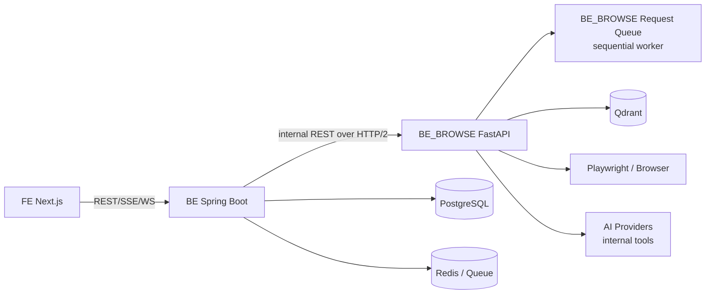

# BE_BROWSE / Spring BE 전환 로드맵

작성일: 2026-06-01

이 문서는 리팩토링 전체 로드맵이다. 세부 설계는 아래 페이지에서 관리한다.

| 페이지 | 설명 |
|--------|------|
| [BE/BE.md](BE/BE.md) | Spring BE 설계. DTO, OOP, CQRS, AOP, DIP, Actuator, QueueJob, DB 책임 |
| [BE_BROWSE/BE_BROWSE.md](BE_BROWSE/BE_BROWSE.md) | FastAPI BE_BROWSE 설계. search engine, request queue, browser/crawling, OCR, AI 도구 |
| [CONNECT/CONNECT.md](CONNECT/CONNECT.md) | BE와 BE_BROWSE 연결 설계. HTTP/2, enqueue/status/result, UUID, 보안, 배포 |
| [CONNECT/API.md](CONNECT/API.md) | BE_BROWSE internal API 명세 |

## 목표 구조

현재 `BE/` NestJS 단일 백엔드를 `BE`와 `BE_BROWSE`로 분리한다.

| 대상 | 기술 | 책임 |
|------|------|------|
| `BE/` | Spring Boot + Java 21 | public API, auth, domain CRUD, DB, queue orchestration, FE event |
| `BE_BROWSE/` | FastAPI + Python | search engine, browse/crawling, browser automation, OCR/RAG, AI 도구 실행 |



## 핵심 원칙

1. FE는 Spring BE만 호출한다.
2. BE_BROWSE는 내부 실행 서버이며 외부에 공개하지 않는다.
3. AI는 BE_BROWSE의 정체성이 아니라 내부 도구다.
4. BE_BROWSE의 모든 실행 요청은 UUID request queue에 들어가고 순차 처리된다.
5. Spring BE는 사용자-facing QueueJob과 DB 상태를 소유한다.
6. BE와 BE_BROWSE의 공식 계약은 REST over HTTP/2다.
7. MCP는 이번 전환 범위에 넣지 않는다.
8. DB migration과 코드 이동은 같은 작업에 섞지 않는다.

## 현재 상태

- 현재 `BE/`는 NestJS 11 기반이다.
- `ai`, `browse`, `research`, `vector`, `queue`, `chat`, `news`, `recruit`, `company`, `media`, `auth`가 한 프로세스에 섞여 있다.
- FE는 `FE/app/lib/api/base.ts`에서 기본적으로 `:3001/api`를 호출한다.
- 배포는 `deploy/k8s/40-be.yaml` 기준 `be` 단일 Deployment다.
- 전환 중 기존 NestJS는 `BE_legacy`로 간주한다.

## 목표 디렉터리

```text
ResearchAI/
├── FE/
├── BE/                    # 신규: Spring Boot
├── BE_BROWSE/             # 신규: Python FastAPI search execution server
├── BE_legacy/             # 임시: 기존 NestJS
├── docs/refactor/
└── deploy/
```

초기에는 실제 rename을 바로 하지 않는다. 먼저 `BE_BROWSE/`와 `BE_spring/` 또는 임시 디렉터리로 검증한 뒤 전환 지점에서 이름을 정리한다.

## 단계별 계획

### Phase 0. 준비와 동결선 설정

- [ ] 현재 API endpoint inventory 생성
- [ ] 현재 TypeORM entity inventory 생성
- [ ] 현재 AI/browse/search/crawler dependency inventory 생성
- [ ] queue `TaskType`별 executor와 입력/출력 스키마 정리
- [ ] FE API wrapper 목록 정리
- [ ] compatibility policy 결정

완료 기준:

- `docs/refactor/api-inventory.md`
- `docs/refactor/data-inventory.md`
- `docs/refactor/search-engine-inventory.md`

### Phase 1. BE_BROWSE 스캐폴드

상세: [BE_BROWSE/BE_BROWSE.md](BE_BROWSE/BE_BROWSE.md)

- [ ] FastAPI + Pydantic v2 + uv skeleton 생성
- [ ] request queue skeleton 생성
- [ ] enqueue/status/result/cancel API 추가
- [ ] sequential worker 추가
- [ ] search engine root 구조 생성
- [ ] HTTP/2 실행 방식 결정
- [ ] Dockerfile 추가

완료 기준:

- `cd BE_BROWSE && uv run pytest`
- `curl localhost:8001/health`
- `POST /v1/requests`가 `beBrowseRequestId`를 반환
- worker가 순차 처리
- `GET /v1/requests/{id}/result`로 결과 조회 가능

### Phase 2. BE_BROWSE AI Provider 이관

상세: [BE_BROWSE/BE_BROWSE.md](BE_BROWSE/BE_BROWSE.md)

- [ ] 현재 `AiProviderService` public method 목록 정리
- [ ] model registry 이전
- [ ] Anthropic/OpenAI/Google/Groq/Ollama/llama.cpp adapter 이전
- [ ] provider fallback, throttle, retry, timeout 정책 구현
- [ ] AI call log event schema 정의. 저장은 Spring BE가 담당

완료 기준:

- 기존 prompt test가 BE_BROWSE enqueue -> sequential worker -> result 조회 흐름으로 성공

### Phase 3. BE_BROWSE Search Engine 이관

상세: [BE_BROWSE/BE_BROWSE.md](BE_BROWSE/BE_BROWSE.md)

- [ ] `research/infrastructure/search`를 search engine으로 이전
- [ ] browser crawling을 `application/search/browse`로 이전
- [ ] company discovery를 `application/search/company`로 이전
- [ ] recruit discovery를 `application/search/recruit`로 이전
- [ ] DuckDuckGo/Tavily/Serper/Naver/Brave adapter 이전
- [ ] Puppeteer를 Playwright Python으로 대체
- [ ] crawler fixture test 작성

완료 기준:

- recruit/company career page 탐색이 BE_BROWSE search engine 경유로 동작

### Phase 4. Spring BE 스캐폴드

상세: [BE/BE.md](BE/BE.md)

- [ ] Spring Boot 3 + Java 21 skeleton 생성
- [ ] DTO package와 변환 규칙 생성
- [ ] command/query use case 패키지 생성
- [ ] DIP port 목록 작성
- [ ] AOP annotation/aspect 초안 작성
- [ ] ArchUnit 결합도 보호 테스트 추가
- [ ] Actuator 추가
- [ ] BE_BROWSE client 추가
- [ ] Java 21 virtual thread executor 구성

완료 기준:

- FE가 `NEXT_PUBLIC_API_BASE=http://localhost:8080`로 최소 health/config 호출 가능
- `/actuator/health`, readiness/liveness health group 정상 응답

### Phase 5. DB 전환

- [ ] TypeORM entity inventory 기준 ERD 재작성
- [ ] PostgreSQL 선택
- [ ] Flyway migration 작성
- [ ] SQLite export script 작성
- [ ] migration dry-run 수행
- [ ] Qdrant metadata ownership 정리

완료 기준:

- local PostgreSQL에서 Spring BE integration test 통과
- SQLite -> PostgreSQL migration rehearsal 문서화

### Phase 6. Auth / Settings 이관

- [ ] `users` schema 이전
- [ ] password hash compatibility 확인
- [ ] JWT 발급/갱신 정책 재구현
- [ ] `X-Anon-Id` 처리 유지
- [ ] user API key 암호화 저장 구현
- [ ] FE auth wrapper와 middleware 검증

완료 기준:

- 기존 FE 로그인/회원가입/토큰 갱신이 Spring BE에서 동작

### Phase 7. Queue / CONNECT 이관

상세: [CONNECT/CONNECT.md](CONNECT/CONNECT.md), [CONNECT/API.md](CONNECT/API.md)

- [ ] Spring `QueueJob` schema 이전
- [ ] `beBrowseRequestId` 저장
- [ ] BE_BROWSE enqueue/status/result/cancel client 구현
- [ ] polling 또는 event stream 전략 결정
- [ ] SSE endpoint compatibility 구현
- [ ] job cancellation, retry, timeout 정책 구현

완료 기준:

- Spring QueueJob -> BE_BROWSE enqueue -> sequential worker -> result 조회 -> Spring event 저장 흐름으로 완료

### Phase 8. 도메인 API 이관

권장 순서:

1. `config`, `overview`, `metrics`
2. `auth`
3. `company`
4. `recruit/job-posting`
5. `recruit/resume`, `cover-letter`, `documents`
6. `news`, `papers`, `tech-blog`
7. `sessions`, `chat`, `research`

각 화면별 반복 절차:

- [ ] FE API wrapper endpoint 확인
- [ ] Spring controller/use case/repository 구현
- [ ] 필요한 실행 작업은 BE_BROWSE client로 위임
- [ ] NestJS endpoint와 응답 shape 비교
- [ ] API integration test 추가

완료 기준:

- 화면 단위로 Spring-only 동작 확인

### Phase 9. 배포 전환

상세: [CONNECT/CONNECT.md](CONNECT/CONNECT.md), [CONNECT/API.md](CONNECT/API.md)

- [ ] `run.sh` dev 실행을 FE + Spring BE + BE_BROWSE + DB + Qdrant로 변경
- [ ] `deploy/k8s/40-be.yaml`을 Spring BE용으로 교체
- [ ] `deploy/k8s/41-be-browse.yaml` 추가
- [ ] PostgreSQL manifest/PVC/secret 추가
- [ ] ingress route 정리. `/api`, `/ws`는 Spring BE
- [ ] BE_BROWSE는 ClusterIP 내부 서비스만 노출
- [ ] Spring BE -> BE_BROWSE HTTP/2 활성화

완료 기준:

- local과 k8s 모두 3서비스 health check 통과

### Phase 10. NestJS 제거

- [ ] 모든 FE API wrapper가 Spring BE를 호출하는지 확인
- [ ] NestJS만 쓰는 env var와 secret 제거
- [ ] NestJS Docker build 제거
- [ ] `BE_legacy/` archive tag 생성
- [ ] docs를 Spring/BE_BROWSE 기준으로 갱신

완료 기준:

- NestJS 프로세스 없이 주요 기능 동작

## 결정 사항

| 항목 | 결정 |
|------|------|
| Spring 언어 | Java 21 |
| Spring style | OOP first + Hexagonal |
| Spring API model | DTO required |
| Spring async model | MVC + Java 21 virtual threads |
| Spring pattern | CQRS + AOP + DIP |
| Coupling guard | ArchUnit + import rules |
| BE_BROWSE framework | FastAPI |
| BE_BROWSE execution | UUID request queue + sequential worker |
| BE_BROWSE search model | Search engine root |
| BE/BE_BROWSE contract | REST over HTTP/2 |
| MCP | 사용하지 않음 |

## 작업 로그

| 날짜 | 작업자 | 내용 | 다음 단계 |
|------|--------|------|-----------|
| 2026-06-01 | Codex | BE/BE_BROWSE/CONNECT 문서 분리 | 각 페이지 기준으로 Phase 1부터 구현 |
